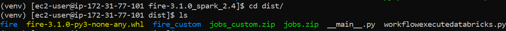
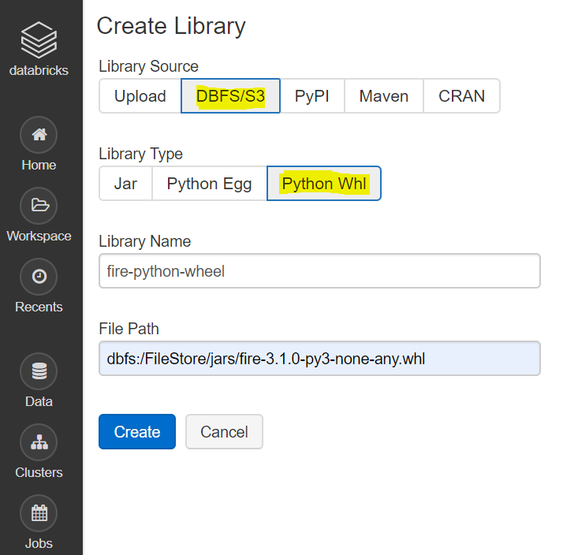
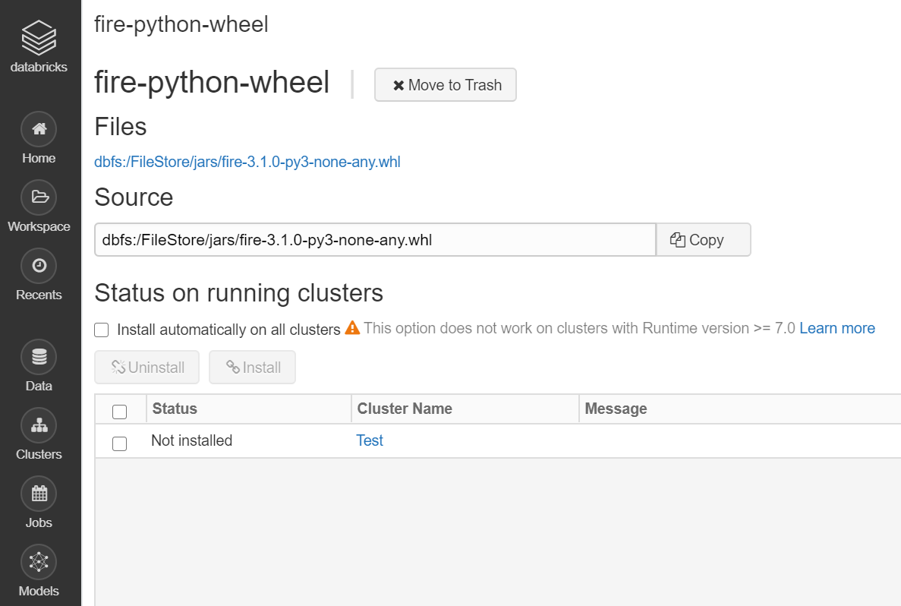
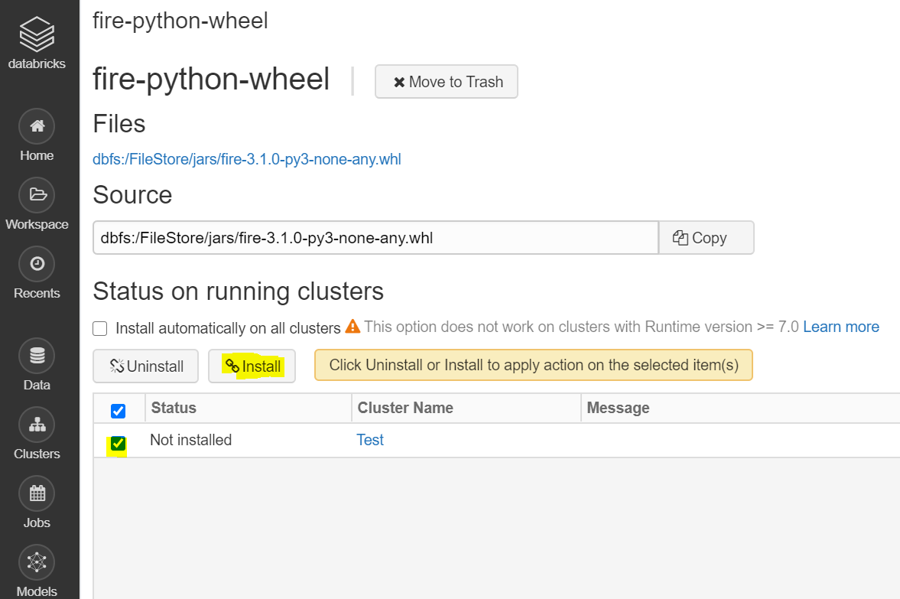
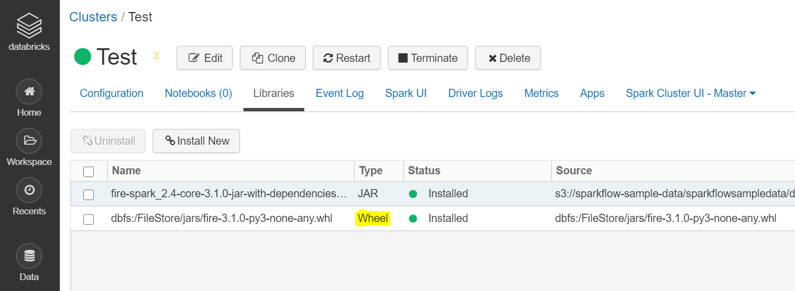
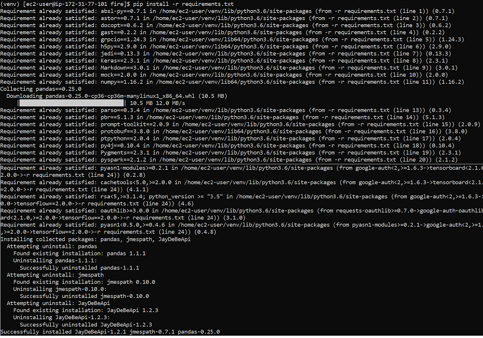
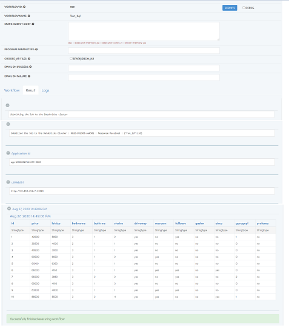

Databricks Python Integration Steps
======================

Fire Insights integrates with Databricks with python package. It submits jobs to the Databricks clusters using the REST API of Databricks and have the results displayed back in Fire Insights.

Below are the steps for Integrating Fire Insights with your Databricks Clusters using python package.

NOTE: The Machine should have python with version 3.7.0 or above.

Install Fire Insights
-----------

Install Fire Insights on any machine. The machine has to be reachable from the Databricks cluster.

Upload Fire wheel file to Databricks
----------------------------------

Fire Insights wheel file has to be uploaded to Databricks. Fire Insights jobs running on Databricks make use of this wheel file, as it contains all python package needed.

Upload ``fire-x.y.z/dist/fire-3.1.0-py3-none-any.whl`` to Databricks. Upload it under Workspace as a Library on to Databricks under DBFS.

1. Login to ``Databricks Cluster``
++++++++++++++++++++++++++++++++

2. Click on ``workspace`` in the left side pane
++++++++++++++++++++++++++++++++

.. figure:: ../_assets/configuration/azure_workspace.PNG
   :alt: Databricks
   :align: center
   :width: 40%
   
3. Create a new Library
++++++++++++++++++++++++++++++++

you can select Library Source as ``DBFS``, Library Type as ``Python Whl``, add some name in ``Library Name`` field, & add File Path of ``fire-3.1.0-py3-none-any.whl`` located in DBFS.

On Clicking on ``Create`` button it will ask to install on specific databricks Cluster, select cluster on which you want to install.

   

   
On Successfull installation of wheel file on Databricks Cluster, it will show under ``Libararies``.

Upload Fire workflowexecutedatabricks.py file to DBFS
----------------------------------

For Python Job submission to Databricks Cluster.

Upload ``fire-x.y.z/dist/workflowexecutedatabricks.py``, file to DBFS.

.. figure:: ../_assets/configuration/workflow.PNG
   :alt: Databricks
   :align: center
   :width: 40%

You can ``UPLOAD`` it, using DBFS Browser too.

.. figure:: ../_assets/configuration/databr_wf.PNG
   :alt: Databricks
   :align: center
   :width: 40%

Configure the Uploaded Library in Fire Insights
------------------------------------

Configure the path of the uploaded fire python wheel package file & workflowexecutedatabricks.py under ``databricks.pythonFile`` & ``databricks.pythonPackages`` respectively in Fire Insights.

.. figure:: ../_assets/configuration/db_configure.PNG
   :alt: Databricks
   :align: center
   :width: 40%

Install python package
-----------------------

You need to install python package on the machine by running Command ``pip install -r requirements.txt`` from ``fire-x.y.z/dist/fire/`` directory.

Run Command ``pip install -r requirements.txt``

Note: Make sure that pip etc is already installed on that machine

Job Submission using Pyspark Engine
-----------------------------------

Now You can submit the pyspark Job on Databricks Cluster from Fire Insights application.

