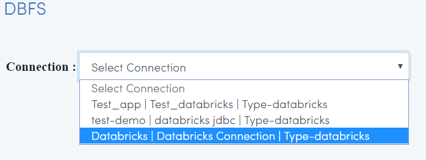
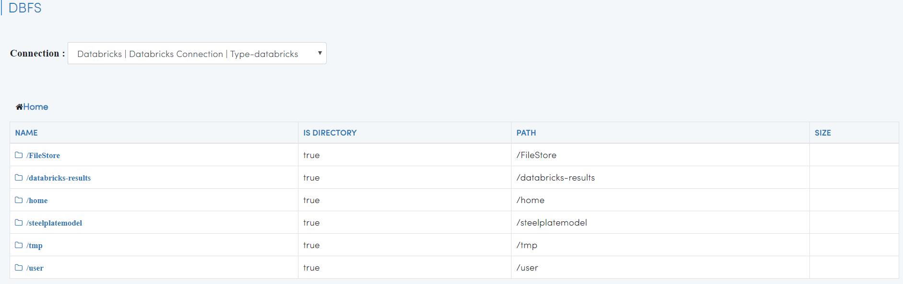

Browse DBFS
============

Fire Insights enables you to browse your DBFS.

Go to DATA BROWSERS/DBFS
----------------------

It will display the various Databricks Connections in your Applications.

Select the relevant connection 
----------------------

Your Databricks File System would be displayed.

