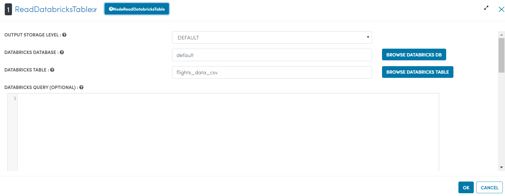
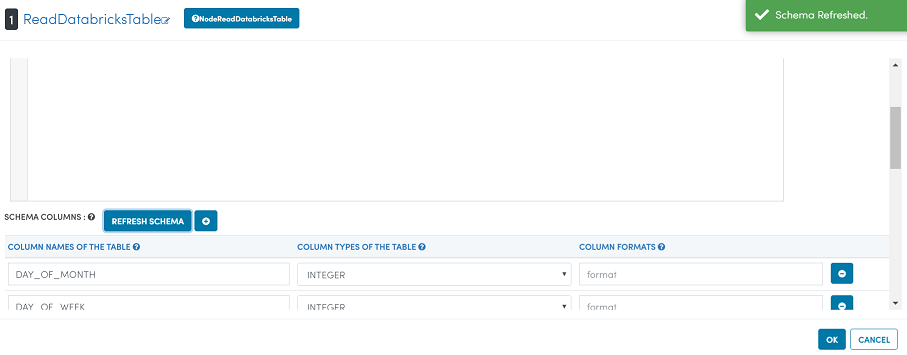
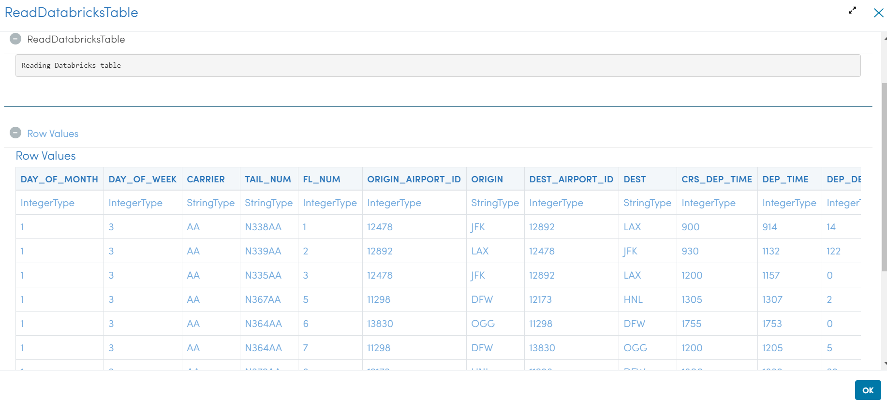
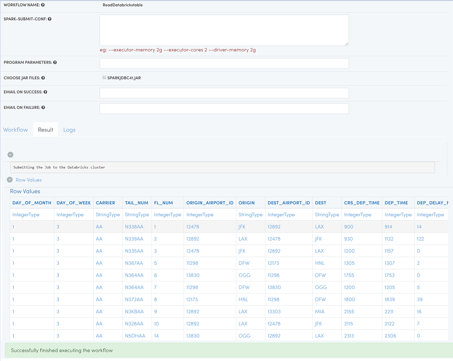
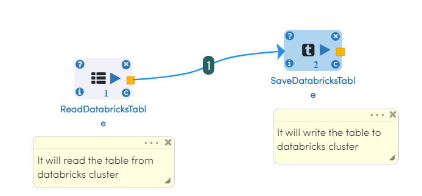
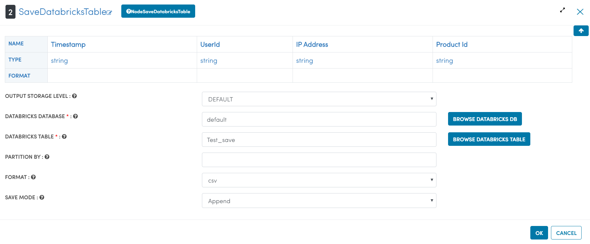
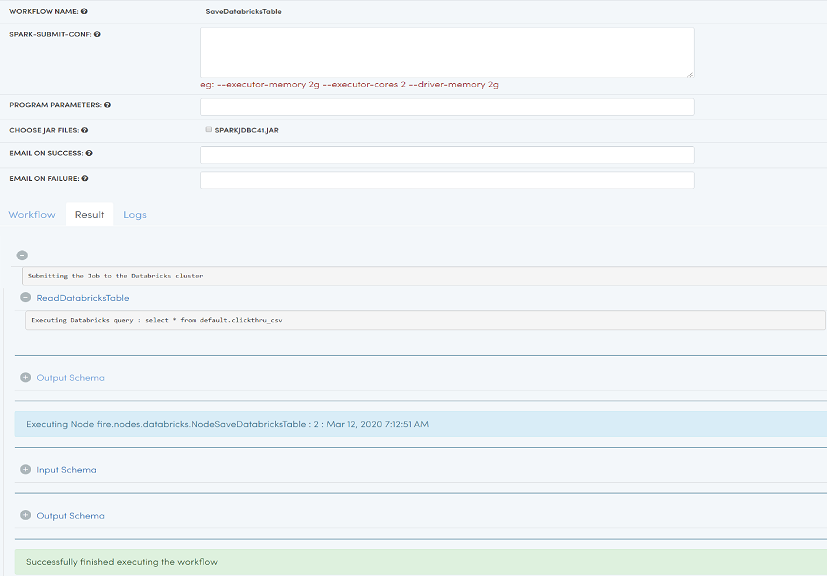
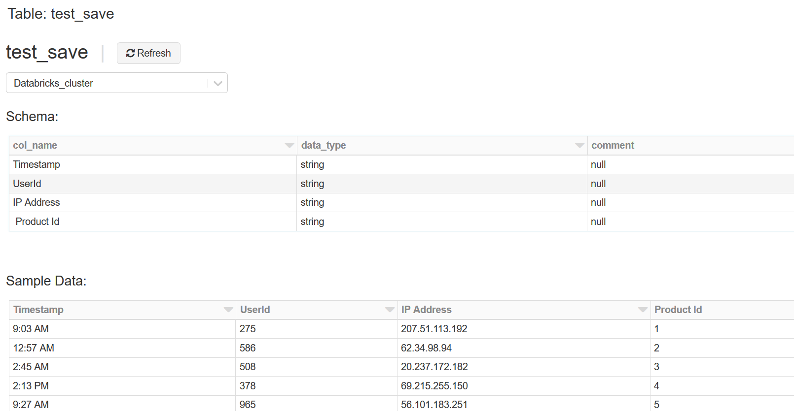

Reading / Writing
======================

Fire Insights enables you to read from and write to Databricks tables.

Below is a workflow which read data from the Databricks table xyz. It then processes the data and finally writes out the result to the Databricks table abc.

Read Databricks table in Workflow
------------------------------------------

In the workflow use the processor 'ReadDatabricksTable'. It will allow you to read tables from Databricks.

Then use the other processors in Fire for processing the data read from the Databricks Table.

Workflow
++++++++

.. figure:: ../_assets/configuration/workflow-databricks.PNG
   :alt: Databricks
   :align: center
   :width: 60%

Processor Configurations for ReadDatabricksTable
++++++++

Refresh schema for processor ReadDatabricksTable
++++++++
 

Processor executions for ReadDatabricksTable
++++++++

Databricks Workflow execution
++++++++

Below is the output of executing the above workflow which reads data from a Databricks table.

   
   
Write to Databricks Table in Workflow
---------------------------------------

In the workflow use the processor 'SaveDatabricksTable'. It will allow you to save tables to Databricks.

Workflow
++++++++

Processor Configurations for SaveDatabricksTable
++++++++

Databricks Workflow execution
++++++++

Below is the output of executing the above workflow which Save the data to Databricks table.

* Verify the Table

it will show that table written successfully, Got saved to databricks cluster.

   
   

