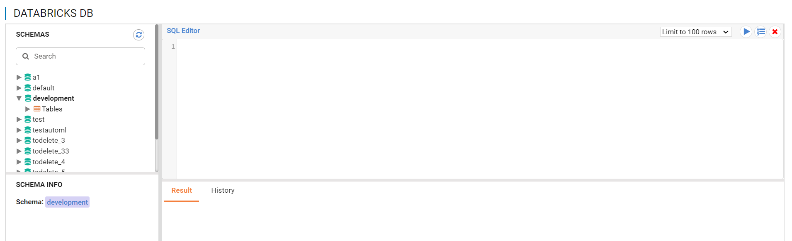
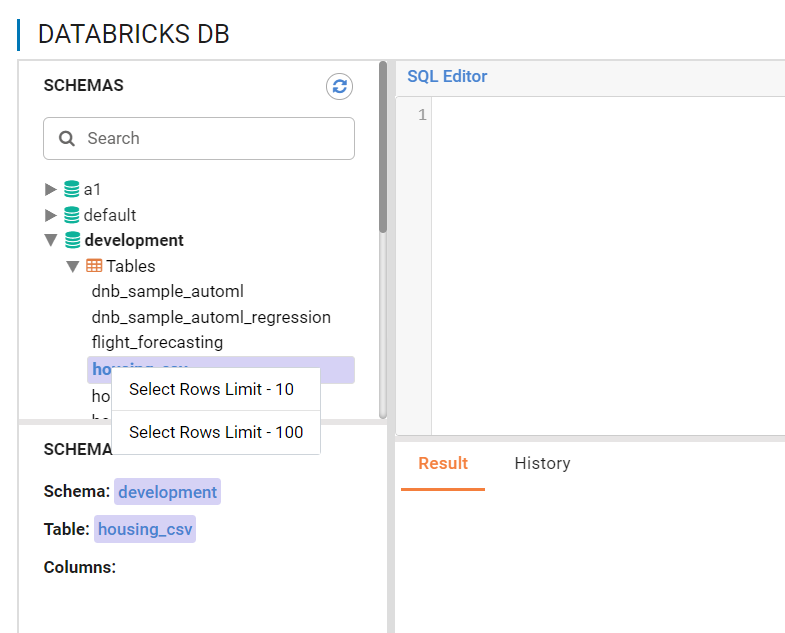
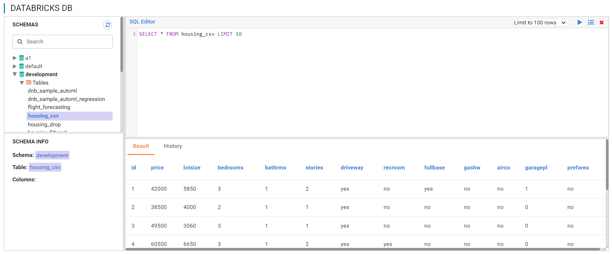

Browse Databricks Tables
===========================

Fire Insights allows you to browse your Databricks databases & tables. Follow the steps given below in order to gather more information about this feature.

Traverse to Data -> Databricks DB from top menu
----------------------

It will display the Databricks DB page.

Select the Tables 
----------------------

Once you select a Table, right-click on it to get the query to view the first few records from the table.

   
Execute the SQL query to view records from the table selected.

