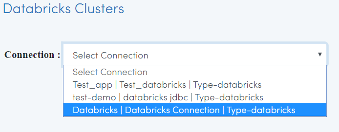
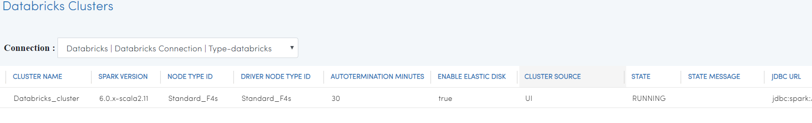

Viewing Databricks Clusters
====================

Fire Insights enables you to view your Databricks Clusters. You can also Start and Stop the Databricks clusters from Fire Insights.

Go to Data Browsers/Databricks Clusters
----------------------

It will display the various Databricks Connections in your Applications.

Select the relevant connection 
----------------------

It will use it for viewing the Databrick Cluster details.

