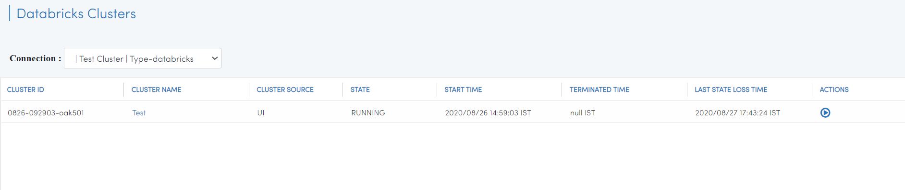
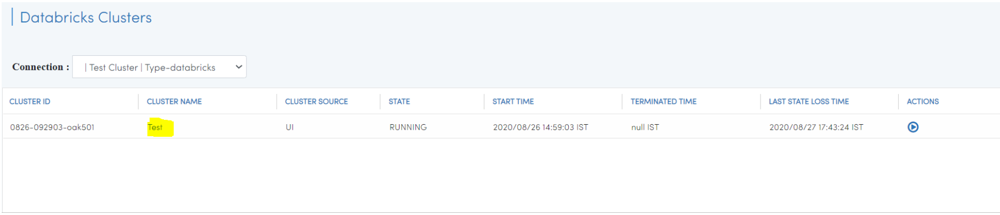
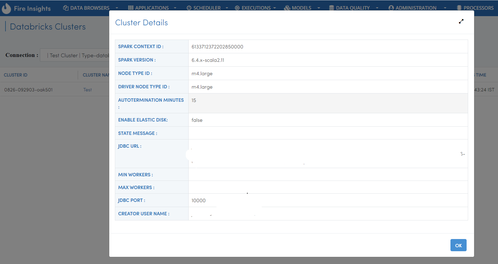
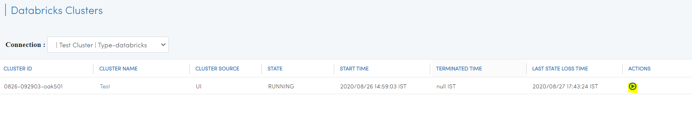

View Databricks Clusters
====================

Fire Insights enables you to view your Databricks Clusters. You can also Start and Stop the Databricks clusters from Fire Insights.

Go to Data Browsers or Databricks Clusters
----------------------

It will display the various Databricks Clusters available.

If you wish to see cluster details, click on ``CLUSTER NAME`` to display all the related information.

   
   
You can also Start and Stop the Databricks clusters from Fire Insights, using the ``ACTIONS`` button.

