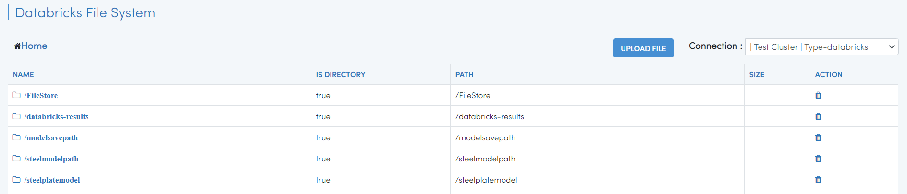
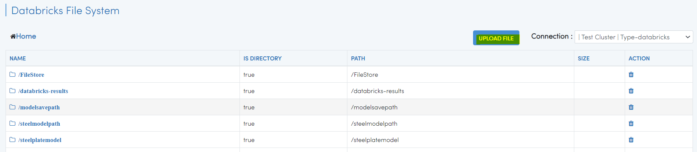
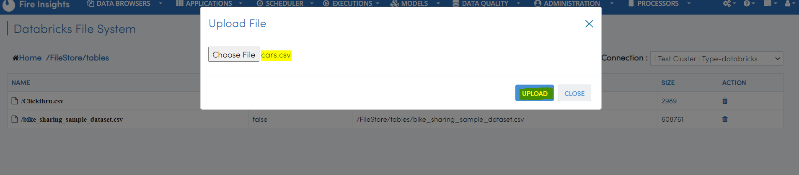
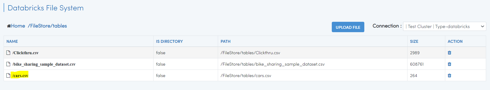
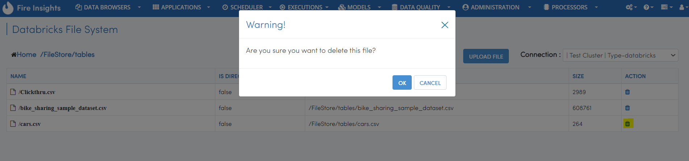
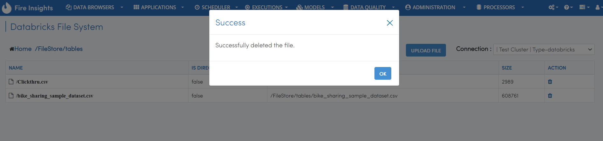

Interact with DBFS
============

Fire Insights enables you to browse your DBFS, Upload & Delete files and directories in DBFS.

Go to DATA BROWSERS/DBFS
----------------------

It will display the Databricks File System list page.

   
Upload File in DBFS
----------------------

You can upload file in ``DBFS`` from local pc.

On clicking the ``UPLOAD FILE`` button, it will ask you to select the file from the local pc and UPLOAD.

On successful ``UPLOAD``, it will show successful information and the file can be viewed inside the folder in  ``DBFS``.

.. figure:: ../../_assets/configuration/success.PNG
   :alt: Databricks
   :width: 60%
   

   
Delete file and directory in DBFS
---------------------------------

You can delete files and directories in DBFS using the delete ``ACTION`` button.

A successful ``deletion``, will show successful information, and the file can be viewed inside the folder in  ``DBFS``.

