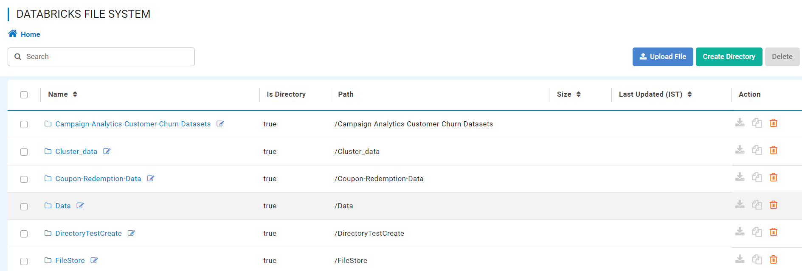
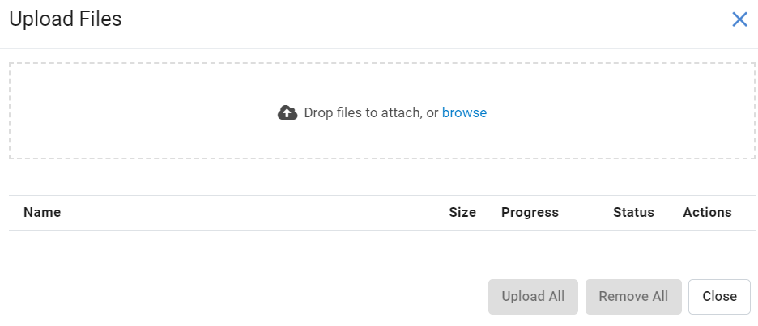
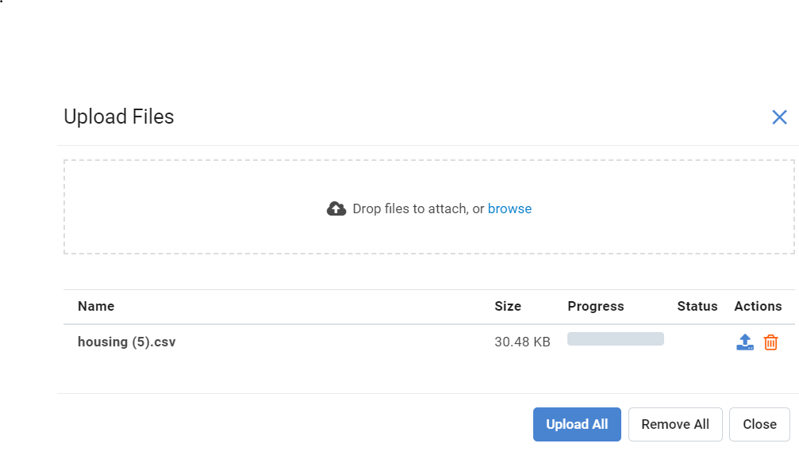
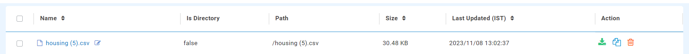
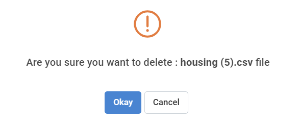

Upload and View files on DBFS
============

Fire Insights enables you to browse your DBFS, Upload & Delete files and directories in DBFS.

Go to DATA BROWSERS or DBFS
----------------------

It will display the Databricks File System list page.

   
Upload File in DBFS
----------------------

You can upload files to ``DBFS`` from your laptop.

Click on the ``UPLOAD FILE`` button to ``Choose File`` from your laptop and then click on ``Upload`` to upload the file.

On successful ``UPLOAD``, the file can be viewed inside the folder on  ``DBFS``.

 

   
Delete File and Directory in DBFS
---------------------------------

You can delete files and directories in DBFS using the delete ``ACTION`` button.

A successful ``deletion`` will display success information after which the file can be viewed inside the folder in ``DBFS``.

