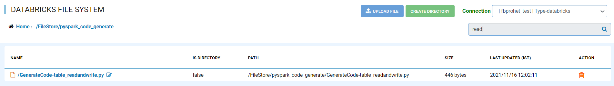
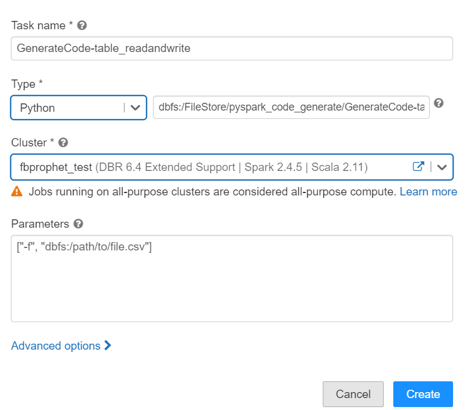
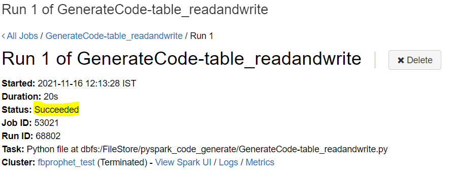

Generate Pyspark Code
====================

Fire Inisghts enables you to Generate PySpark Code even with Spark engine and run the job using Python engine.

Below are the steps involved in it:

Enable Auto Pyspark Code Generation
---------------

Login to Fire Insights application and Enable Auto Pyspark Code Generation from the Configurations page.

Go to ADMINISTRATION, select configuration, choose MODULE tab and search for 'module.enableAutoPysparkCodeGeneration' and make it to 'true' as by default it will be false. 

.. figure:: ../../_assets/user-guide/generate-pyspark-code/1.PNG
   :alt: Pyspark code generate
   :width: 70%

Generate Pyspark Code
----------------

Once the Configuration gets enabled for Generating Pyspark Code, create a sample workflow using Spark engine and save it.

.. figure:: ../../_assets/user-guide/generate-pyspark-code/2.PNG
   :alt: Pyspark code generate
   :width: 70%
   
Once the workflow gets saved, go to workflow editor page, click on the three dots on the top right corner of workflow editor page, and select ``Generate Pyspark Code``.

.. figure:: ../../_assets/user-guide/generate-pyspark-code/3.PNG
   :alt: Pyspark code generate
   :width: 70%

Once you select the option of Generate Pyspark Code, a window will open with Pyspark sample code for the sample workflow, copy it and save it into '.py' file.

.. figure:: ../../_assets/user-guide/generate-pyspark-code/4.PNG
   :alt: Pyspark code generate
   :width: 70%

Upload Generated Pyspark Code in DBFS
--------------

Now, as you have the Generated Pyspark Code saved in your local system, upload it into DBFS which is accessible from databricks cluster.

Submit Jobs on Databricks Cluster
----------

Once you have uploaded the Generated Pyspark Code in DBFS, you are ready to create Jobs in databricks using the details given below:

::

    Task name: Add Unique Task name
    Type : Select Type as Python & Enter the URI of the Python file to be executed
    Cluster : Select any existing databricks cluster or even new one.
    Parameters : If any
    Advanced options : Add dependency if any
    

Once the above parameters gets added, click on Create Button, it will create a new job with your selected parameters.

Now, you can Run the job.

   
Once the Job runs successfully, you will see the Status of the Job as Succeeded.

