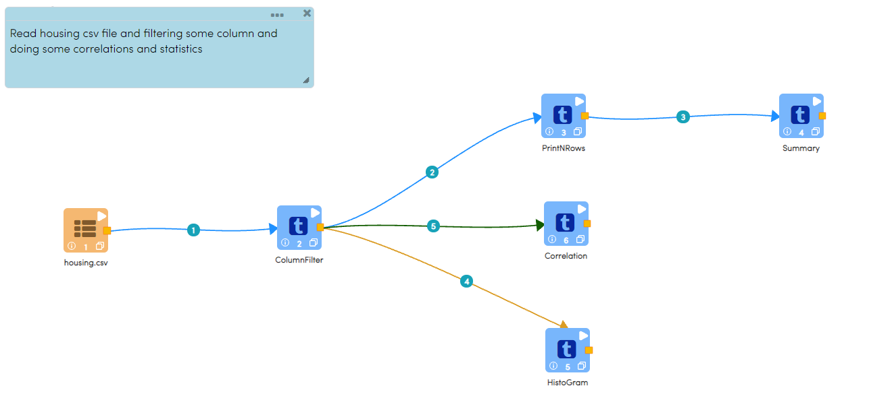
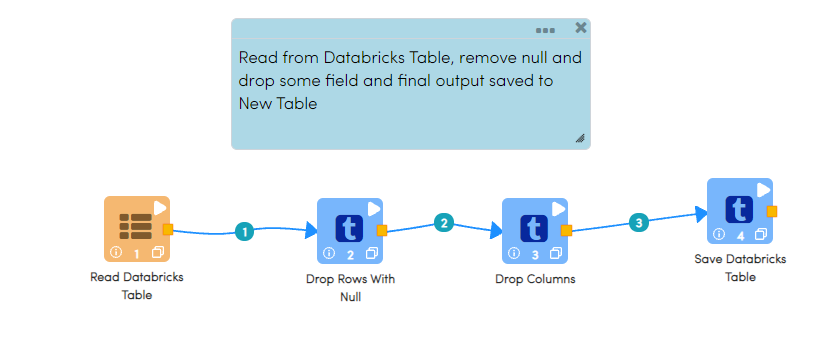
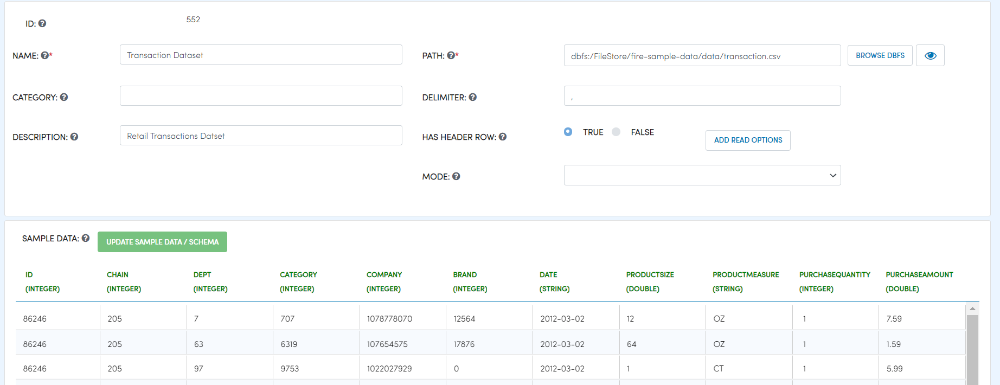
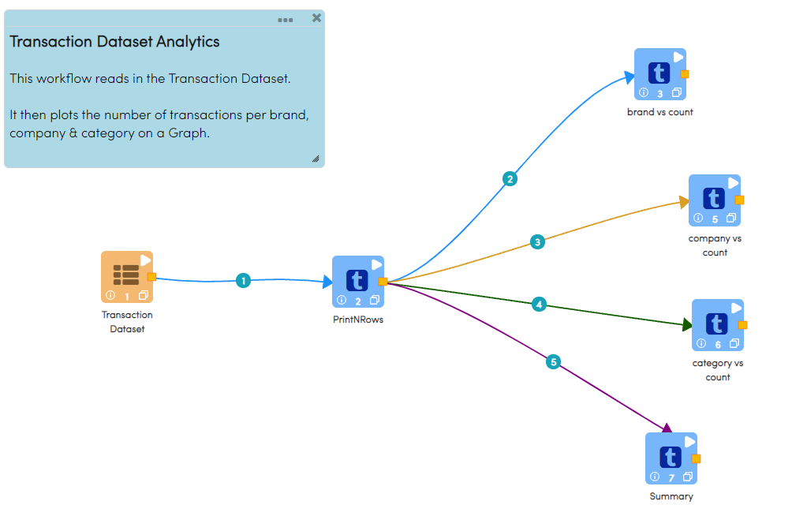

Read CSV Files
=================================

There are multiple ways to read and process CSV files in Fire Insights.

* Use Read CSV node in the workflow for reading the CSV file from DBFS.
* Create an unmanaged Databricks Table on the csv file. Then use the Read Databricks Table node in the workflow.
* Create a Dataset in Fire Insights on the CSV file in DBFS. Then use that Dataset in a workflow.

Using Read CSV node
-------------------

The workflow below has a Read CSV node which reads CSV files from DBFS and processes them.

The path of the file can either be the CSV file itself, or it can be a folder containing many csv files of the same schema.

Create an unmanaged Databricks Table on the csv file
---------------

The command below shows an example of creating an unmanaged Databricks Table on the csv file.

::

    CREATE TABLE `housing` ( `id` INT, `price` DOUBLE, `lotsize` INT, `bedrooms` INT, `bathrms` INT, `stories` INT, `driveway` STRING, `recroom` STRING, `fullbase` STRING, `gashw` STRING, `airco` STRING, `garagepl` STRING, `prefarea` STRING) USING com.databricks.spark.csv OPTIONS ( `multiLine` 'false', `escape` '"', `header` 'true', `delimiter` ',', path 'dbfs:/FileStore/sample-data/data/housing.csv' ) 

The workflow below uses the Read Databricks Table Node to read in the data from the Databricks table created above.

Create a Dataset in Fire Insights on the csv file
-------------

Fire Insights supports the concept of Datasets. Dataset is the definition of the data it represents. This way the Dataset can be defined just once and used in multiple workflows.

Below is the creation of a Dataset on a CSV file.

The below workflow shows using the Dataset created previously.

  

