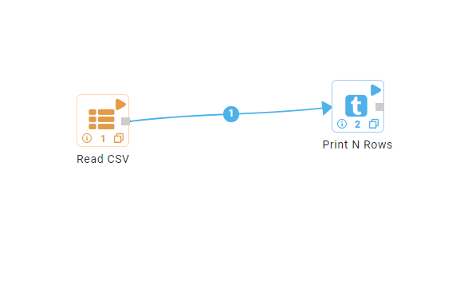
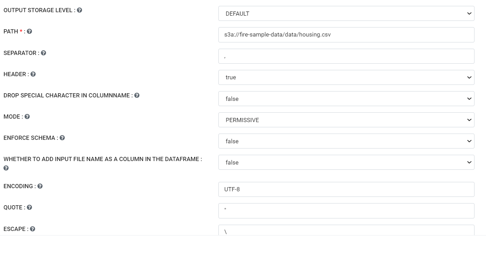
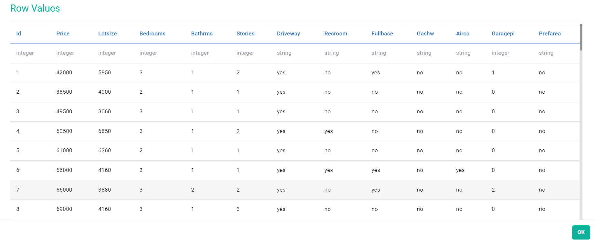

Read from S3
=========================

There are two ways in the Databricks to read from S3. You can either read data using an IAM Role or read it using Access Keys. Databricks recommends leveraging IAM Roles in Databricks.

Fire Insights allows you to browse your Data in S3 and create workflows using them. When the job is submitted to Databricks, the job reads data from the S3 location and processes them.

You can also create external tables in Databricks over data in S3. Fire Insights can process data from Databricks tables.

To get more details, read `Databricks Documentation. <https://docs.databricks.com/_static/notebooks/data-import/s3.html>`_

Access S3 Buckets from Databricks
-------------------------------------

For detailed information regarding the setup for accessing S3 buckets from Databricks, read `Databricks Documentation. <https://docs.databricks.com/security/credential-passthrough/iam-passthrough.html>`_

Read the Data from S3 in Workflow
-----------------------------------

In Sparkflows, user can read the data from S3 location using processors like ReadCSV, ReadParquet, ReadJson, etc.

Workflow
++++++++
Below is a workflow which reads data from S3:

Processor Configuration
+++++++++++++++++++++++++

Browse S3 Path and Refresh Schema for ReadCSV Processor :

Workflow Execution Results
+++++++++++++++++++++++++

Execution results would look like below:

