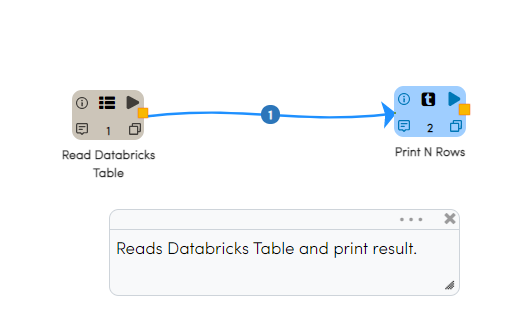
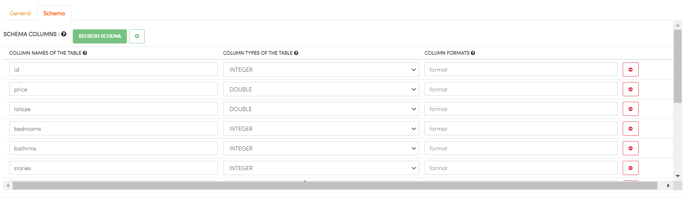
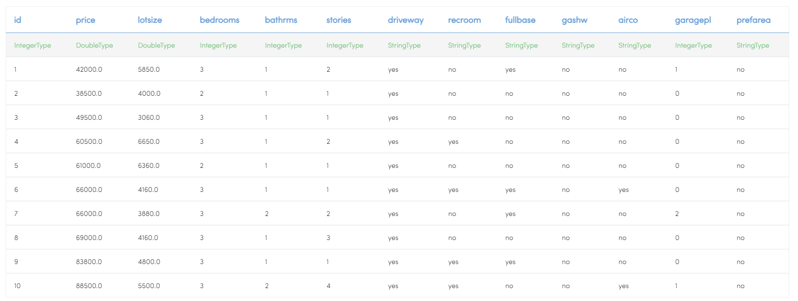
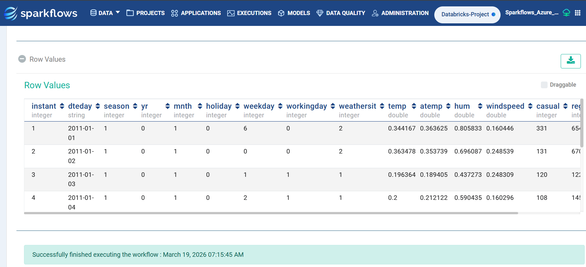

Read Databricks Tables
======================

Fire Insights enables you to read from and write to Databricks tables.

Below is a workflow which reads data from the Databricks table ``xyz``. It then processes the data and prints some sample results.

Read Databricks Table in Workflow
------------------------------------------

In the workflow, use the processor 'ReadDatabricksTable'. It will allow you to read tables from Databricks.

Then, use the other processors in Fire for processing the data read from the Databricks Table.

Workflow
++++++++

Processor Configurations for ReadDatabricksTable
++++++++

* DATABRICKS DATABASE : Click on BROWSE STUDIO DB and select specified database.
* DATABRICKS TABLE : Click on BROWSE STUDIO TABLE and select specified Table.

.. figure:: ../../_assets/configuration/databricks-editor.PNG
   :alt: Databricks
   :width: 80%

Refresh Schema for Processor ReadDatabricksTable
++++++++
 

Processor Executions for ReadDatabricksTable
++++++++

Databricks Workflow Execution
++++++++

Below is the output of executing the above workflow which reads data from a Databricks table.

   
   
