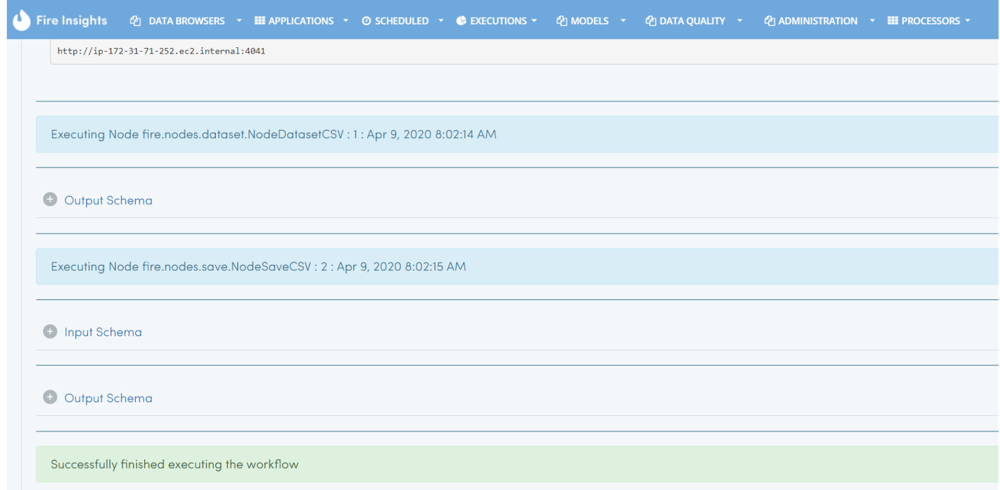
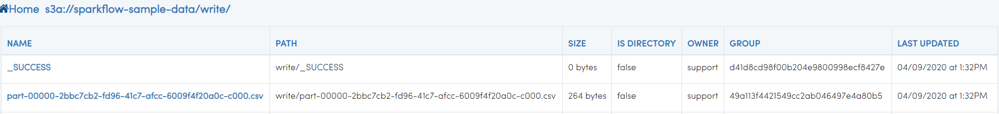

Writing to S3 files
=========================

https://docs.databricks.com/_static/notebooks/data-import/s3.html

Fire Insights workflows can write data to S3 locations.

Here is an example workflow that writes data to S3. When the workflow is executed, the Dataframe is saved to the S3 location.

In the dialog box of the save CSV processor, the path is specified as ``s3a://sparkflow-sample-data/write/``

.. figure:: ../../_assets/aws/csvsave-workflow.PNG
   :alt: S3 Workflow
   :width: 60%

Browse S3 specified Path & other parameters for processor SaveCSV 

.. figure:: ../../_assets/aws/configuration-csvs3.PNG
   :alt: S3 Workflow
   :width: 80%

Execution Result

Once the above workflow successfully completed, the saved data can be viewed using ``DATABROWSERS/AWS S3`` Location with the specified path

