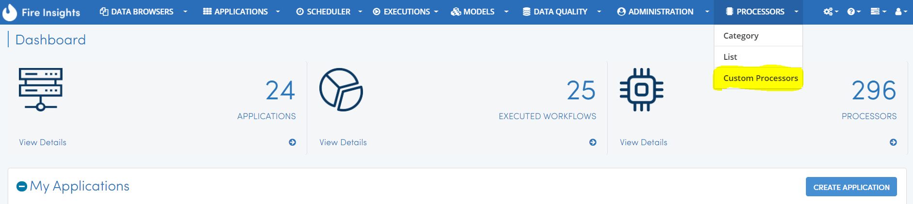
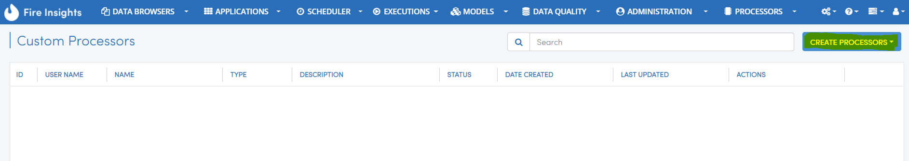
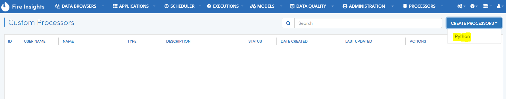

Custom Node Development in Browser
==================================

Fire Insights enables you to write custom nodes from your Browser.

You would provide the execute method for the Processor and the Schema update code. You would also provide the details of the widgets through which the user would provide the parameters for the new custom node.

Below are the steps for creating the custom node.

Once you login to Fire Insights application, there is ``PROCESSORS`` menu in top, select Custom Processors.

Click on Create New Custom Node
-------------------------------

Click on ``Create Processors`` to start creating the new processor.

   
   

   
It would open up the Create Processor Page as below.

Enter the name and other details for the new processor.

Then provide details for the various fields of the new processors. These fields would appear in the process dialog when used in the workflow editor.

.. figure:: ../_assets/developer-guide/processor_editor.PNG
   :alt: Custom Processor
   :align: center
   :width: 60% 

Click on the ``+`` sign to add a new field. For each field provide the following:

  * WIDGET
  * NAME
  * TITLE
  * VALUE
  * DESCRIPTION
  
.. figure:: ../_assets/developer-guide/fields.PNG
   :alt: Custom Processor
   :align: center
   :width: 60% 
  
  
Finally click on the ``Next`` button to go to the Code tab.
  
Execute Code
------------
  
The Code tab is where you write the execution code for the new Custom Processor.
  
It shows the default template which you can update
  
.. figure:: ../_assets/developer-guide/code.PNG
   :alt: Custom Processor
   :align: center
   :width: 60% 
  
Then click on ``Next`` button to go to the Schema tab.
  
Schema Update Code
------------------
  
The Schema tab is where you add the code which updates the incoming schema to produce the output schema of this processor.
  
It displays the default template code which you can update.
  
.. figure:: ../_assets/developer-guide/schema.PNG
   :alt: Custom Processor
   :align: center
   :width: 60%
  
Finally click on the ``Submit`` button to finish creating the new custom processor.

once the custom processor submitted successfully, it will be vissible in ``Custom Processors`` list page.
 
.. figure:: ../_assets/developer-guide/submitted_processor.PNG
   :alt: Custom Processor
   :align: center
   :width: 60% 
  
Testing the custom processor
-----------------------------
  
Fire Insights enables you to seamlessly Test your custom processor.
  
When editing the custom processor, select the Dataset for the data you want to feed to the custom processor. Then click on ``Test`` to view the output of the new custom processor.

.. figure:: ../_assets/developer-guide/test_custom_data.PNG
   :alt: Custom Processor
   :align: center
   :width: 60% 
   
.. figure:: ../_assets/developer-guide/execution_test.PNG
   :alt: Custom Processor
   :align: center
   :width: 60%   

Using the new Processor
-----------------------

The processor is now available in the Workflow Editor.

.. figure:: ../_assets/developer-guide/editor.PNG
   :alt: Custom Processor
   :align: center
   :width: 60% 

You can click on the custom processor to start using it in your workflow.

