Custom Node Development in Browser
==================================

Fire Insights enables you to write new custom nodes from your Browser. These custom nodes would then automatically be visible in the workflow editor and can be used in the workflows like any other node.

You would provide the execute method for the node and the schema update code. You would also provide the details of the widgets through which the user would provide the parameters for the new custom node.

Below are the steps for creating the new custom node.

.. note:: Fire Insights uses the terms Node and Processor interchangeably. They essentially are used to build the workflows.

Select Custom Processors from the menu
------------------------------

.. figure:: ../_assets/developer-guide/custom_processor.PNG
   :alt: Custom Processor
   :width: 60%

Click on CREATE PROCESSORS
--------------------------

Click on ``CREATE PROCESSORS`` to start creating the new processor.

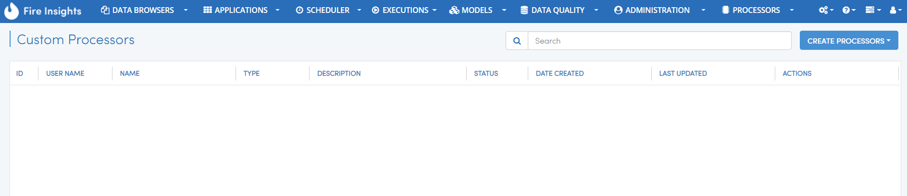
   
   
.. figure:: ../_assets/developer-guide/processor_creation.PNG
   :alt: Custom Processor
   :width: 60%   
   
It would open up the Create Processor Page as below.

Enter the name and other details for the new processor.

Then provide details for the various fields of the new processors. These fields would appear in the processor dialog when used in the workflow editor.

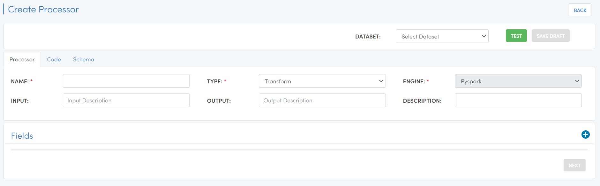

Click on the ``+`` sign to add a new field. For each field provide the following::

    WIDGET
    NAME
    TITLE
    VALUE
    DESCRIPTION
  
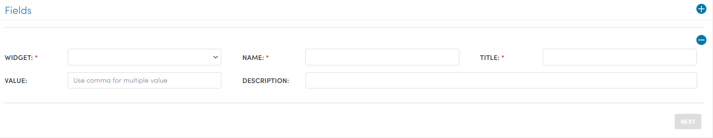
  
  
Finally click on the ``Next`` button to go to the Code tab.
  
Write Custom Execution Code
------------
  
The Code tab is where you write the execution code for the new Custom Processor.
  
It shows the default template which you can update
  
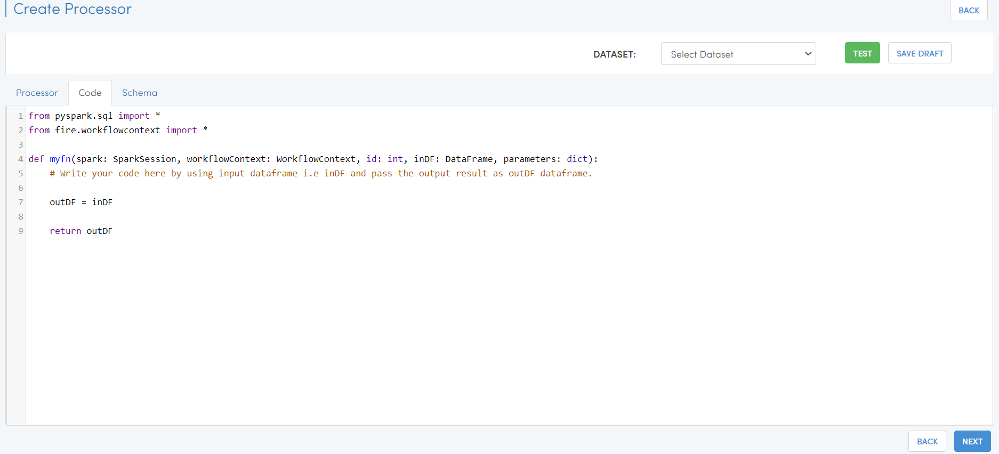
  
Then click on ``Next`` button to go to the Schema tab.
  
  
Write Schema Update Code
------------------
  
The Schema tab is where you add the code which updates the incoming schema to produce the output schema from this processor.
  
It displays the default template code which you can update.
  
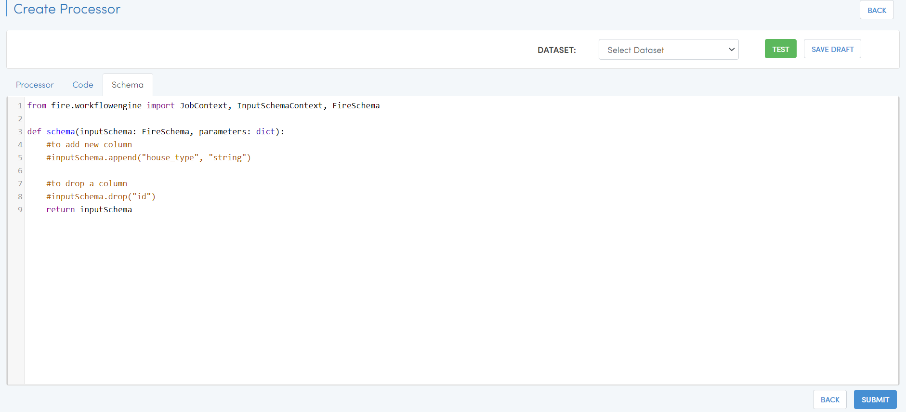
  
Finally click on the ``Submit`` button to finish creating the new custom processor.

Once the custom processor is submitted successfully, it will be visible in ``Custom Processors`` list page.
 
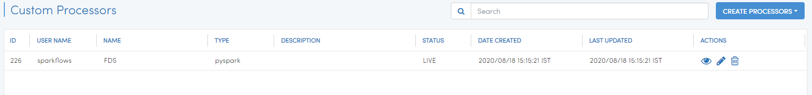
  
Testing the custom processor
-----------------------------
  
Fire Insights enables you to seamlessly Test your custom processor.
  
When editing the custom processor, select the Dataset for the data you want to feed to the custom processor. Then click on ``Test`` to view the output of the new custom processor.

.. figure:: ../_assets/developer-guide/test_custom_data.PNG
   :alt: Custom Processor
   :width: 60% 
   
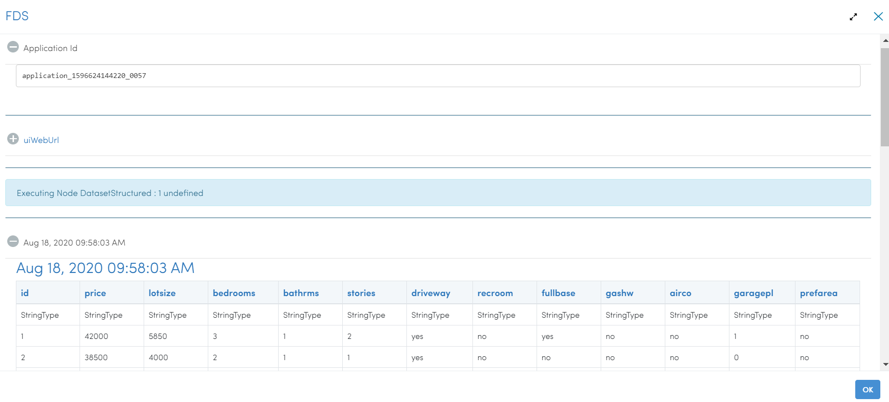

Using the new Processor
-----------------------

The processor is now available in the Workflow Editor.

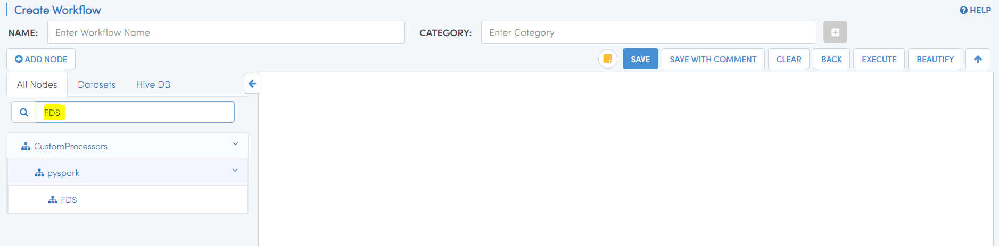

You can click on the custom processor to start using it in your workflow.

You can also export & import them

Exporting Custom Processors
-------------------------

Fire Insights enables you to ``export`` Custom Processors from Browser to local machine.

Below are the steps to export Custom Processors.

Login to Fire Insights & go to Custom Processors list page.

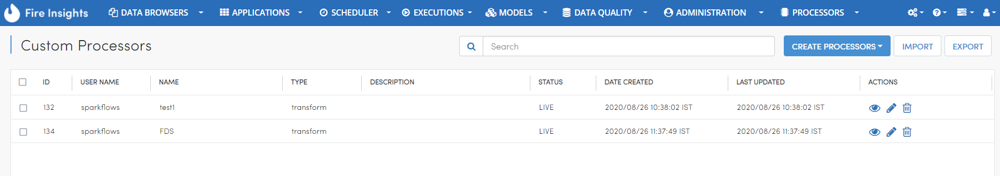

Select the ``Custom Processors`` which you want to export and click on export.

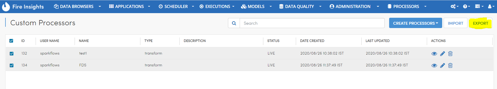

.. note:: you can export multiple ``Custom Processors`` at a time too.

Once you click on export button, the selected Custom Processors will be downloaded to local machine in zip format.

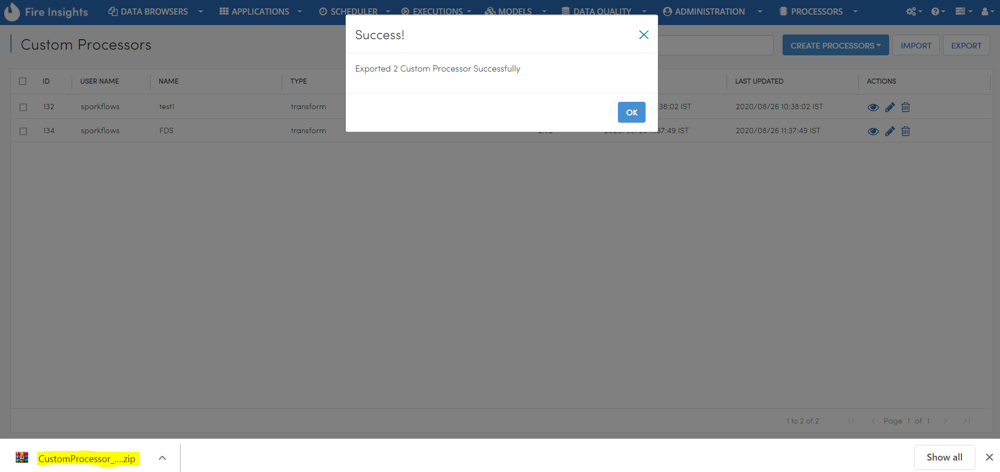

Importing Custom Processors
------------------------

Fire Insights enables you to ``import`` Custom Processors to different environment.

Below are the steps to Import Custom Processors.

Login to Fire Insights & go to Custom Processors list page.

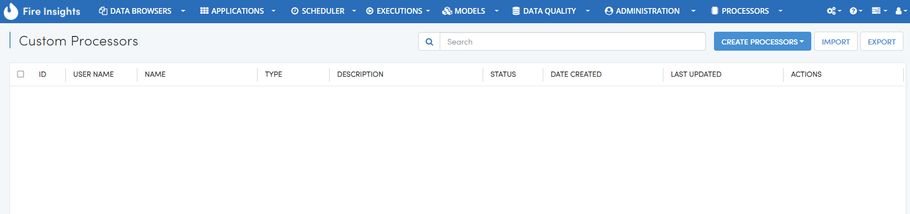

Select the ``IMPORT`` button, it will open a new windows to upload zip file from local machine.

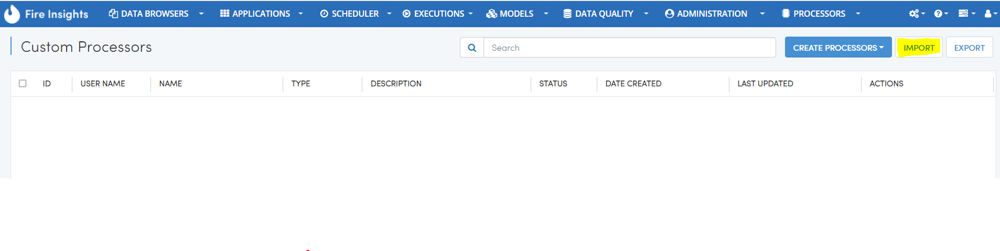

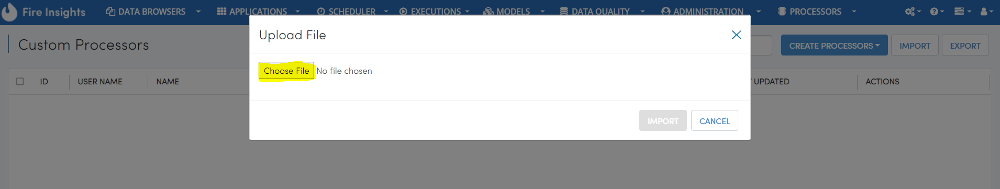

Once you upload zip file of Custom Processors from local machine, press ``IMPORT`` button to import it.

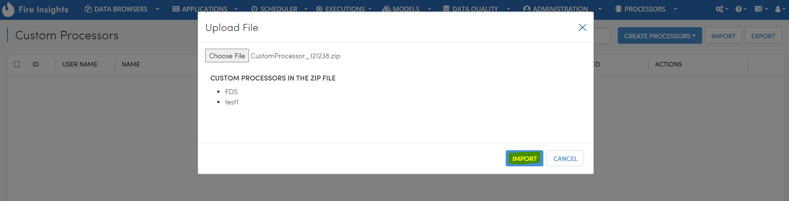

NOTE: You can import multiple ``Custom Processors`` at a time too.

Once you Click on IMPORT button, success message will display on imported Custom Processors.

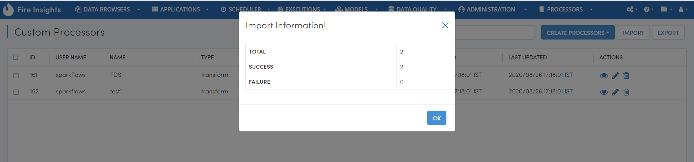

After success import, you can view those ``Custom Processors`` in Custom Processors list page.

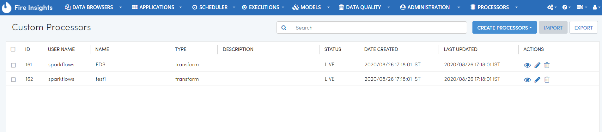
   
Now you can use those Custom Processors in your workflow.   
