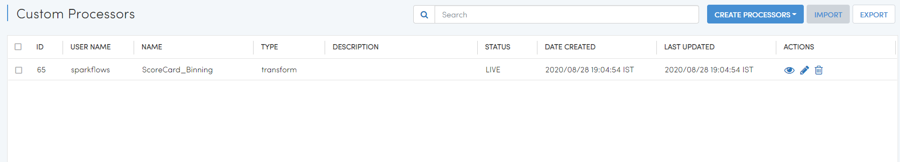
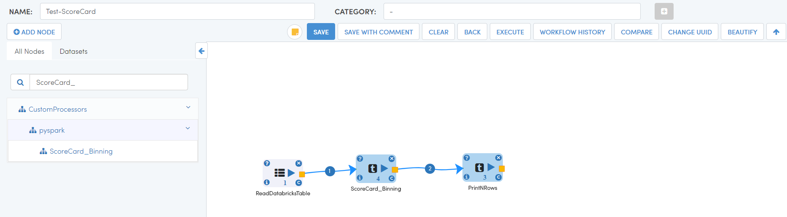
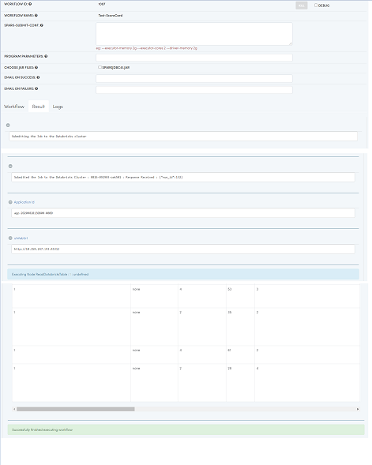

Building and Running Custom Node - Databricks
================================

Sparkflows allows you to build your own Custom Nodes.

In this tutorial we would build a custom node built upon scorecardpy.

Install the scorecardpy dependencies
------------------------------------

Since we are using the library scorecardpy, we would install its packages both on the Sparkflows machine and on the Databricks cluster.

Use the command below to install it on the Sparkflows machines:

  * ``pip install scorecardpy``

Install it on your Databricks cluster with the below:

  * Open a Notebook
  * %sh pip install scorecardpy
  

Go to Custom Processors
---------------------

Once you login to Sparkflows application, there is ``PROCESSORS`` menu in top, select Custom Processors.

.. figure:: ../_assets/developer-guide/custom_processor.PNG
   :alt: Custom Processor
   :width: 60%

Click on CREATE PROCESSORS
-------------------------------

Click on ``CREATE PROCESSORS`` to start creating the new processor.

.. figure:: ../_assets/developer-guide/create_processor.PNG
   :alt: Custom Processor
   :width: 60%
   
   
.. figure:: ../_assets/developer-guide/processor_creation.PNG
   :alt: Custom Processor
   :width: 60%   
   
It would open up the Create Processor Page as below.

Enter the name and other details for the new processor.

Then provide details for the various fields of the new processors. These fields would appear in the processor dialog when used in the workflow editor.

.. figure:: ../_assets/developer-guide/processor_editor.PNG
   :alt: Custom Processor
   :width: 60% 

Click on the ``+`` sign to add a new field. For each field provide the following:

  * WIDGET
  * NAME
  * TITLE
  * VALUE
  * DESCRIPTION

.. figure:: ../_assets/developer-guide/fields.PNG
   :alt: Custom Processor
   :width: 60% 
  
  
Finally click on the ``Next`` button to go to the Code tab.
  
Execute Code
------------
  
The Code tab is where you write the execution code for the new Custom Processor.

Its updated for scorecardpy here.
  
It shows the default template which you can update for scorecardpy.
  
.. figure:: ../_assets/developer-guide/code.PNG
   :alt: Custom Processor
   :width: 60% 
  
Then click on ``Next`` button to go to the Schema tab.
  
Schema Update Code
------------------
  
The Schema tab is where you add the code which updates the incoming schema to produce the output schema from this processor.
  
It displays the default template code which you can update.
  
.. figure:: ../_assets/developer-guide/schema.PNG
   :alt: Custom Processor
   :width: 60%
  
Finally click on the ``Submit`` button to finish creating the new custom processor.

Once the custom processor submitted successfully, it will be vissible in ``Custom Processors`` list page.

Using the new Processor
-----------------------

The processor is now available in the Workflow Editor.

   
You can click on the custom processor to start using it in your workflow & submit the job.

