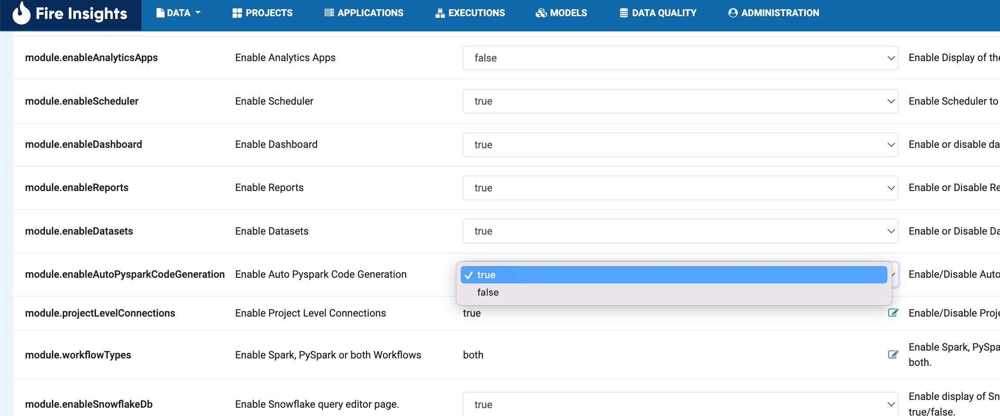
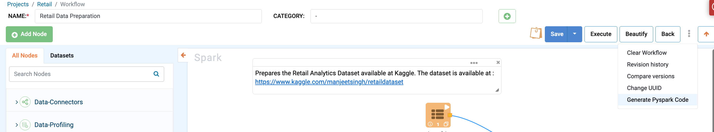
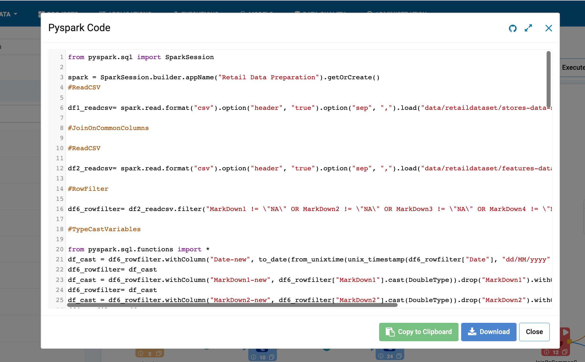

PySpark Code for Workflows
==========================================

Sparkflows provide the option to generate the pyspark code for the workflows.

Enable the PySpark code generation option in Configuration -> Module
--------------------------------------------------------------------

In workflow edit page there is a option to generate pyspark code.

Generated pyspark code can be pushed to configured git repository.

