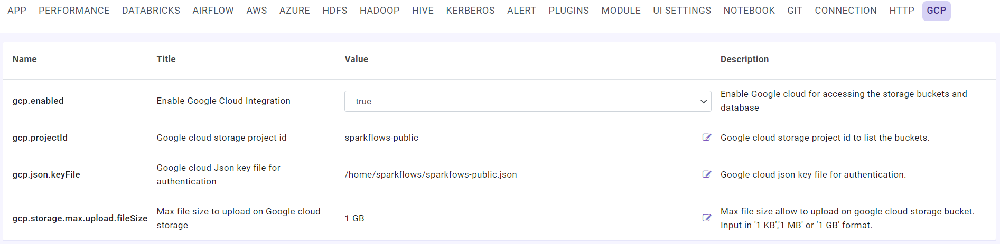
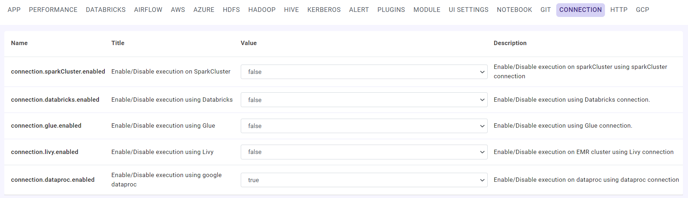
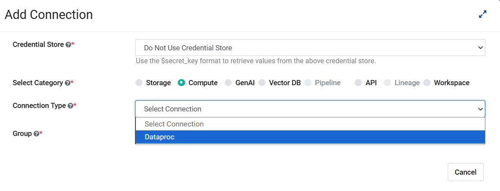
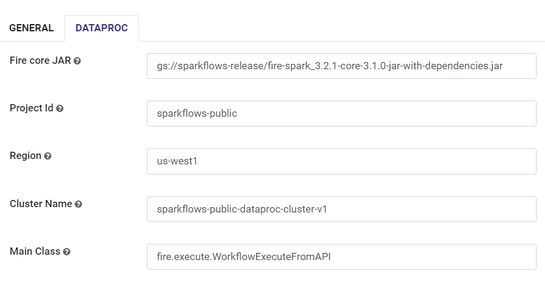

GCP Configuration
=====

Fire Insights is seamlessly integrated with Google cloud platform. With Fire Insights you can perform self-serve data processing, analytics and machine learning on Google Cloud.

Below are steps:

1. Specify GCP Configuration
============

GCP Configuration details can be specified in the Fire Insights Administration UI.

- Enable Google CLoud Integration flag
- Specify the Project Id
- Specify the path to the Service Account Key file

2. Enable Dataproc Connection
============

Enable Dataproc Connection from ``CONNECTION`` tab

::

    connection.dataproc.enabled : true

3. Add Dataproc Connection
============

Dataproc Connections details can be specified in Global Connections.

- Specify the Connection Name
- Specify the Postback Url
   

- Specify the location of Fire Core jar
- Specify the Project Id
- Specify the Region
- Specify the Dataproc Cluster name

Once Dataproc Connection is saved, you can use this connection to submit Jobs, View BigQuery and Browse Google Storage 
