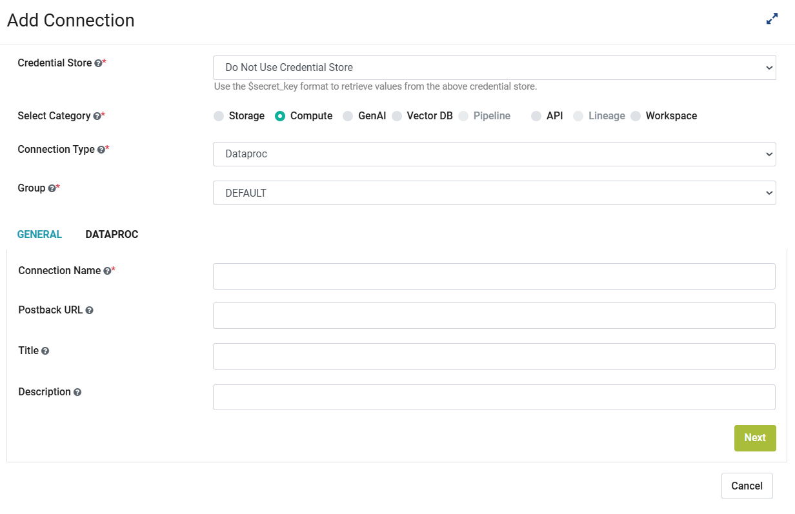
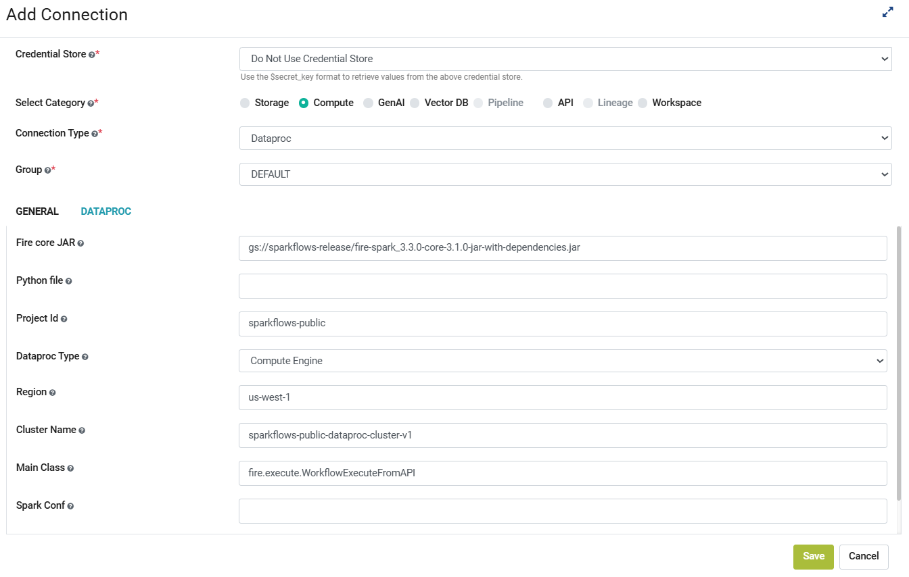

Data Proc Connection
====

Sparkflows allows you to create a Dataproc connection. Connections can be created at various levels:

  * **Global**: Everyone has access to these connections.
  * **Group**: Users belonging to the group have access to these connections.
  * **Project**: The owner of the project and the groups with which the project has been shared with have access to the project level connections.

This document provides steps to create a Dataproc Connection in Fire Insights and automate the creation of workflows/pipelines that interact with Dataproc clusters for large-scale data processing.

Step 1 : Enable Dataproc Connection
++++++++++++

#. Login to **Sparkflows application**
#. Navigate to **Administration -> Configurations -> Connection** and enable **Dataproc Connection** by setting the below parameter:

   ::

     connection.dataproc.enabled : true

   .. figure:: ../../../_assets/gcp/dataproc_connection.PNG
      :alt: GCP Configuration Details
      :width: 60%

Step 2 : Navigate to Add Connections
++++++++++++

Once you save the above Configuration, navigate to **Administration -> Global Connections -> Add Connections** as shown below:

.. figure:: ../../../_assets/aws/livy/administration.png
   :alt: livy
   :width: 60%

Step 3 : Add Connection for Group
++++++++++++

#. Navigate to **Administration -> Global Connections -> Add Connections -> Add Connection For Group** 
#. On the pop up window, select **Compute** and other parameters as shown below:

   .. figure:: ../../../_assets/aws/livy/add_connection.PNG
      :alt: livy
      :width: 60%
   
   .. figure:: ../../../_assets/gcp/dataproc_create.PNG
      :alt: Dataproc
      :width: 60%

Step 4 : Add Additional Parameters 
++++++++++++

Once you have selected the connection type & groups, add the additional connection parameters as per your environment. For more details refer the following tables and images:

For GENERAL Tab
++++
.. list-table:: 
   :widths: 10 20 30
   :header-rows: 1

   * - Title
     - Description
     - Value
   * - Connection name
     - Connection Name
     - Name of Connection
   * - Postback Url
     - Postback Url
     - Postback Url through which Dataproc sent result back to Fire Insights
   * - Title 
     - Title of selected connection
     - Title of selected connection  
   * - Description 
     - Connection Description 
     - Connection Description

For DATAPROC Tab
++++
.. list-table:: 
   :widths: 10 20 30
   :header-rows: 1

   * - Title
     - Description
     - Value
   * - Fire core JAR
     - Path of fire spark core JAR with dependencies
     - Path of fire spark core JAR with dependencies present in Google Cloud Storage
   * - Python file
     - Path of python file
     - Path of python file present in Google Cloud Storage
   * - Project Id 
     - GCS Project Id
     - GCS Project ID for your Google Cloud project
   * - Dataproc Type
     - Deployment mode or Infrastructure model
     - Can be set to either Compute Engine or Serverless
   * - Region
     - Dataproc region
     - Dataproc region
   * - Cluster Name
     - Dataproc Cluster Name
     - Unique identifier for Dataproc cluster
   * - Main Class
     - Dataproc Main Class to execute
     - To be set as fire.execute.WorkflowExecuteFromAPI
   * - Spark Conf
     - Conf to be used. ex:- key1:value1,key2:value2
     - Spark Conf used while Job Submission

**Save** the connection. Once saved, you can use this connection to submit Jobs, view BigQuery and browse Google Storage.

