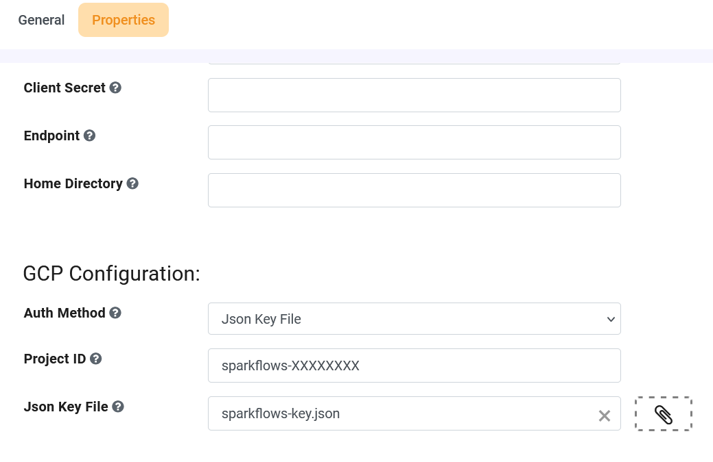

Google Cloud Storage Configuration
========

This document describes the steps for configuring GCS in Sparkflows.

GCP pre-requisites
++++

In order to configure GCS in Sparkflows, the User needs to have the following pre-requisites in GCP:

.. list-table:: 
   :widths: 15 20 30
   :header-rows: 1

   * - Name
     - Description
     - Value
   * - Google cloud Json key file for authentication
     - Google cloud json key file for authentication
     - path of json key file
   * - Google cloud storage project id
     - Google cloud storage project id to list the buckets
     - project Id 

Configure GCS in Sparkflows
+++++++++++++++

Once the above pre-requisites from GCP are available, you can configure GCS in Sparkflows using the below steps:

#. Using Sparkflows Global Configurations
#. Using Sparkflows Group Properties

Using Sparkflows Global Configurations
+++++++++++++++++++++++

**Step 1 : Open Sparkflows in Web Browser**
-------------------------------------------------

#. Open a **web browser**.
#. Enter the URL: http://sparkflows_IP:8080 and replace **sparkflows_IP** with your instance's **actual IP/DNS**.

**Step 2 : Configure GCS**
-----------------------------

#. Login to Sparkflows and navigate to **ADMINISTRATION->Configurations->GCP**.
#. Enable Google Cloud Integration flag by selecting the value as **True**.
#. Specify the **Project Id**.
#. Specify the **path** to the Service Account Key file.

   .. figure:: ../../../_assets/gcp/gcp_enable.PNG
      :alt: GCP Configuration Details
      :width: 60%

.. list-table:: 
   :widths: 10 20 30
   :header-rows: 1

   * - Title
     - Recommended
     - Value
   * - Enable GCP	
     - Enable Google Cloud Integration
     - true
   * - Google cloud storage project id
     - Google cloud storage project id to list the buckets
     - project Id
   * - Google cloud Json key file for authentication
     - Google cloud json key file for authentication
     - path of json key file

Using Sparkflows Group Properties
+++++++++++++++++++++++

**Step 1 : Open Sparkflows in Web Browser**
------------------------------------------------

#. Open a **web browser**.
#. Enter the URL: http://sparkflows_IP:8080 and replace **sparkflows_IP** with your instance's **actual IP/DNS**.

**Step 2 : Configure GCS**
------------------------------

#. **Login** to Sparkflows.
#. Access Sparkflows **Administration** Tab.

   .. figure:: ../../..//_assets/azure/adls_configurations.png
      :alt: livy
      :width: 70%

#. Click on **User Administration** Tab.
#. Select **Group** Tab.
#. Select **Group** to configure GCS.
#. Edit **Group** to configure GCS.
#. Click on **Properties** Tab.
#. Enter **GCS Configuration** Details.
#. Save the **Group**.

.. list-table:: 
   :widths: 10 20 30
   :header-rows: 1

   * - Title
     - Recommended
     - Value
   * - Auth Method
     - Json Key File
     - Json Key File by default
   * - Google cloud storage project id
     - Google cloud storage project id to list the buckets
     - project Id
   * - Google cloud Json key file for authentication
     - Google cloud json key file for authentication
     - Upload json key file
   

.. Note:: 1. Make sure to Enable GCP Configurations ie. ``gcp.enabled=true`` to browse GCS from ``DATA`` Tab.	
          2. Make sure that ``Firewalls and virtual networks`` for Configured storage account should be accessible from Sparkflows VM, ecs based on deployment.

**Step 3 : Browse GCS**
-------------------------

Once the above **configurations** are saved, you can browse gcs as below:

#. Click on **DATA** Tab.
#. Select **GCS**.
#. You can browse GCS file and folder.

   .. figure:: ../../../_assets/gcp/gcs_config_2.png
      :width: 70%
      :alt: adls

.. Note:: 1. The above steps are needed for designer(Interactive) Mode.
          2. For Execution Mode you need to ensure that Dataproc should have sufficient privilege.
