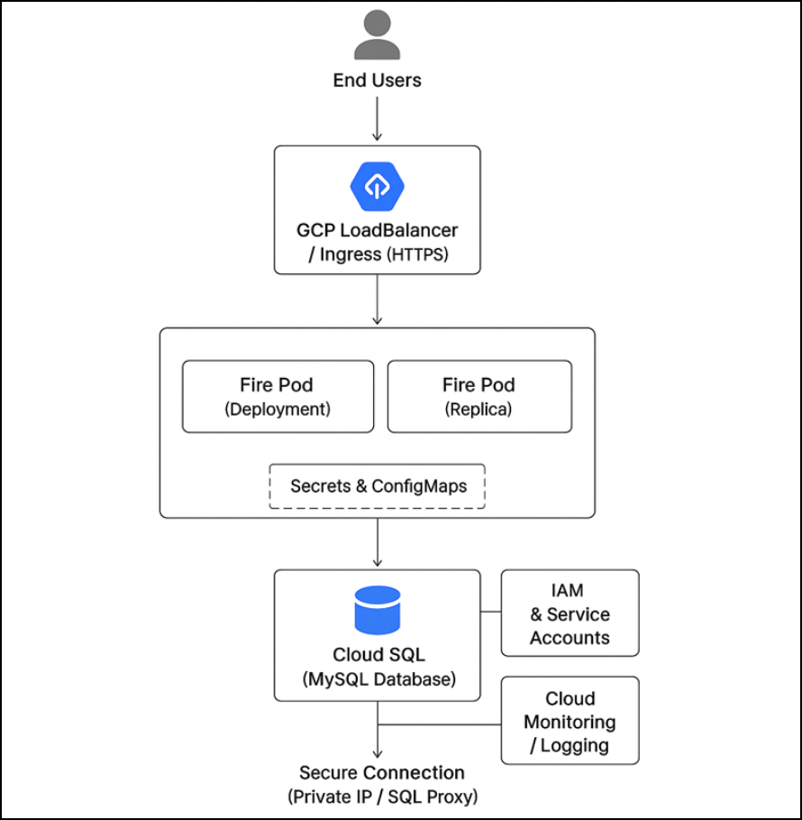

Fire Deployment on GKE with MySQL Metadata DB
====

This document outlines the key components of the Fire application deployment on GKE, covering cluster setup, app pod, external access, and configuration management.

Components
----

1. GKE Cluster
++++

  * **Fire Pod (Deployment)**

    * Runs Fire application container (Web UI + API)
    * Configured with env variables from Kubernetes Secrets:

      * DB_HOST, DB_PORT, DB_USERNAME, DB_PASSWORD, DB_NAME

  * **LoadBalancer Service**

    * Exposes Fire application externally
    * HTTPS ingress configured (via GCP Ingress or LoadBalancer)

  * **Secrets & ConfigMaps**

    * Secrets → MySQL credentials, keystore password
    * ConfigMaps → Fire runtime configs

2. MySQL Database
++++

  * Managed separately (Cloud SQL or VM-hosted MySQL)
  * Stores Fire **metadata** (users, workflows, configs)
  * Connected securely over private network

