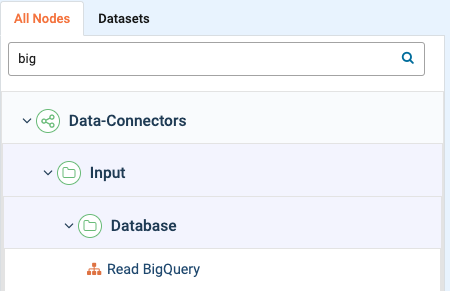
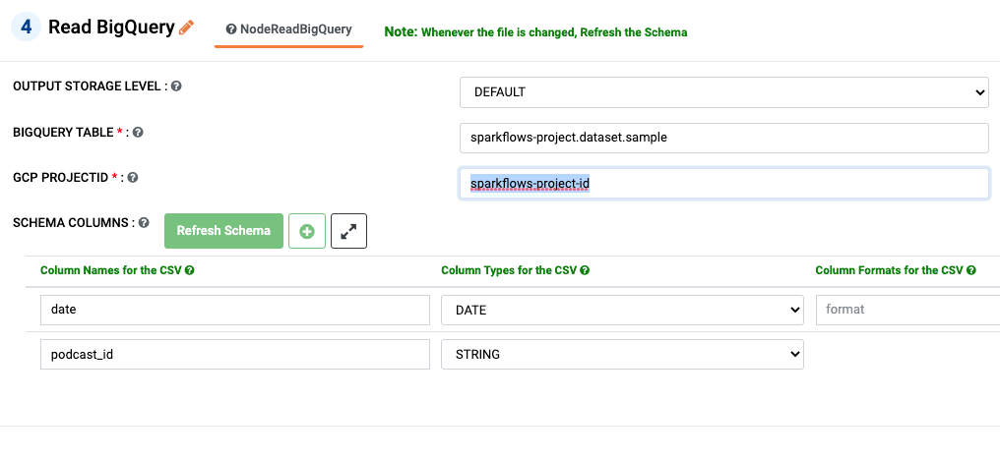

Reading from Big Query
============

Fire Insights has processor for reading from Big Query Tables.

1. Login to ``Fire Insights``
++++++++++++++++++++++++++++++++

2. Navigate to the list of ``workflows`` in the projects dashboard and click on the ``Create`` button to create a new workflow.
++++++++++++++++++++++++++++++++

3. Now search for the ``Read BigQuery`` Node, in the data connectors, drag and drop it to the workflow editor.
++++++++++++++++++++++++++++++++

   
4. Double click on the ``Read BigQuery`` Node, to configure the table connection. Once you've configured, make sure to click on the ``Refresh Schema`` button to fetch the schema. 
++++++++++++++++++++++++++++++++

