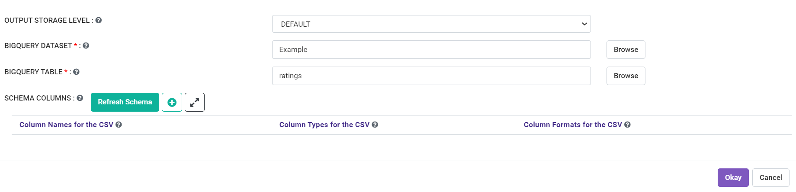

Read from Big Query
============

Fire Insights has processor to read from Big Query Tables.

1. Create a new workflow
++++++++++++++++++++++++++++++++

Create a new workflow or edit an existing one. This would take you to the workflow editor.

2. Create the ``Read BigQuery`` Node
++++++++++++++++++++++++++++++++

Search for the ``Read BigQuery`` Node, in the data connectors, drag and drop it to the workflow editor.

   
3. Configure the ``Read BigQuery`` Node
++++++++++++++++++++++++++++++++

Double click on the ``Read BigQuery`` Node, to configure the table connection. Once you've configured, make sure to click on the ``Refresh Schema`` button to fetch the schema. 

