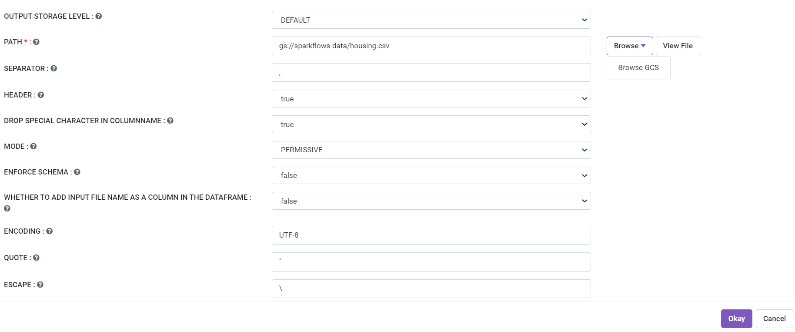
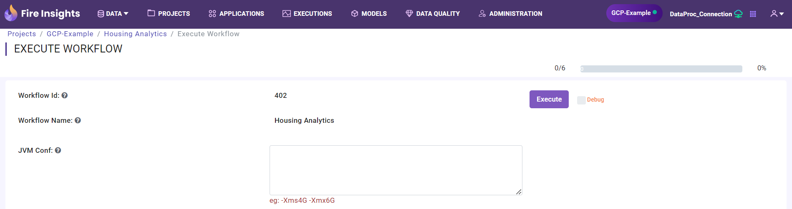
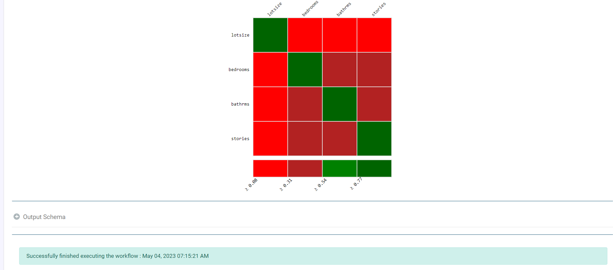

Read from GCS
============

Fire Insights has processor to read from BigQuery Tables.

1. Create a new workflow to read data from GCS
++++++++++++++++++++++++++++++++

- Create a new workflow or edit an existing one in the workflow editor.

2. Use any File Reader Node
++++++++++++++++++++++++++++++++

- In the data connectors, search for File Reader Nodes like ``Read CSV``, ``Read Parquet``, ``Read JSON`` etc. 
- Drag and drop it to the workflow editor.

   
3. Configure the File Reader Node
++++++++++++++++++++++++++++++++

- For example, double click on the selected File Reader Nodes like ``Read CSV``, ``Read Parquet``, ``Read JSON`` etc.
- Select the required file and specify the file specific properties. In ``Read CSV` node, you have to specify how the csv data can be extracted.
- Once you've configured, make sure to click on the ``Refresh Schema`` button to fetch the schema. 

3. Run the Workflow in Dataproc Connection
++++++++++++++++++++++++++++++++

- Execute the workflow in Dataproc to read the data from GCS using Dataproc Connection. 

.. figure:: ../../_assets/gcp/gs_job2.PNG
   :alt: Read Files from GCS
   :width: 60%
   

