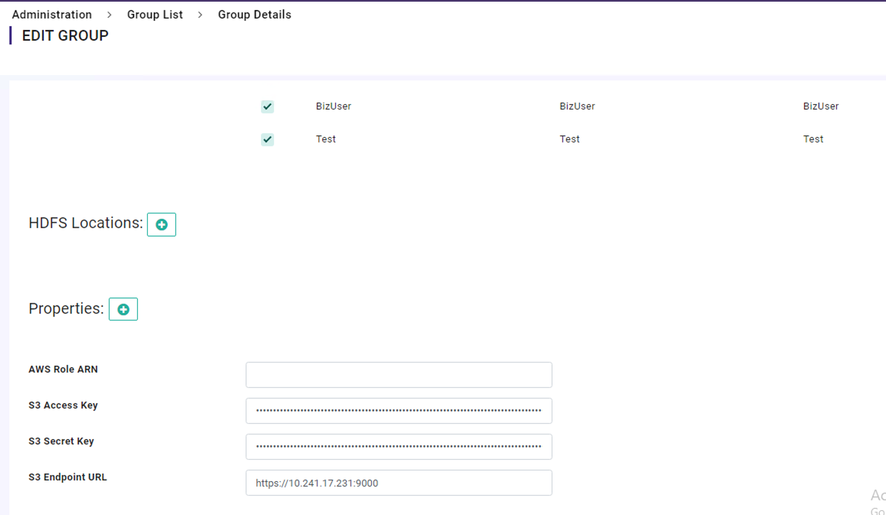
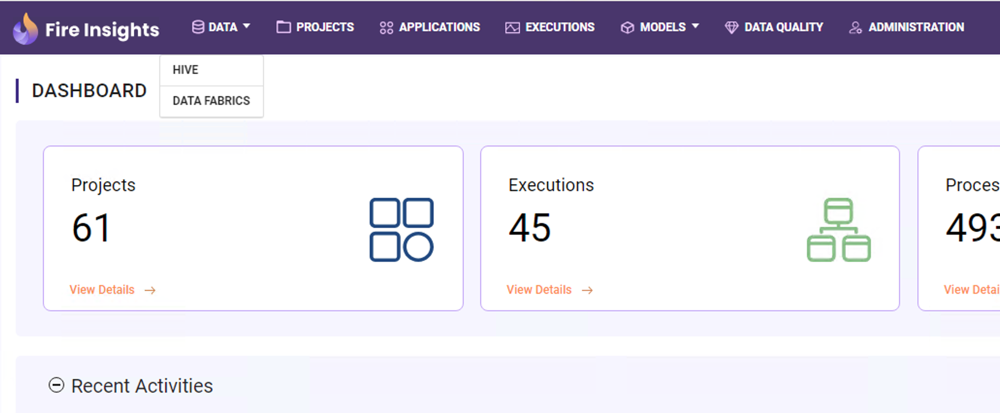

DataFabric
=============

Sparkflows allow users to browse, upload, delete etc operations on data fabric. 
And allow to configure the access at the group level where users in group A can't access the group B resources and vice versa.

1. Connect with the HPE team to get the credentials for the custom S3 endpoint and credentials.
2. In Sparkflows, navigate to Administration > Configuration > Groups  and add the above details to the configuration. 
    Click on the edit button of the group, to view the current settings, and update the configuration with S3 Endpoint details shared by the HPE team.

Configuration

DataFabric Browse

