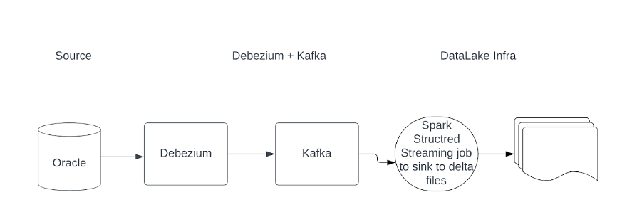

Debezium
======

Overview
-----

Debezium is used to stream DB changes. These changes are then merged into the Dataset.

Design
----

Below is the design of the overall flow.

.. figure:: ../../_assets/hpe/debezium_design.png
      :width: 60%
      :alt: HPE UA Add framework details

#. Debezium reads database logs, produces json messages that describe the changes and streams them to Kafka
#. Kafka streams the messages and stores them in a S3 folder. 
#. Using Spark with Delta Lake we transform the messages to INSERT, UPDATE and DELETE operations, and run them on the target delta lake table.

Useful Command
-----

#. To check the connect

   ::

        curl -H "Accept:application/json" {hostname}:8083/

#. List the connectors

   ::

        curl -H "Accept:application/json" {hostname}:8083/connectors/

#. Register the source with debezium

   ::

        curl -i -X POST -H "Accept:application/json" -H "Content-Type:application/json" {hostname}:8083/connectors/ -d @source.json

#. Source.json will be like this

   ::

        {"name": "inventory-connector",  
        "config": {  
        "connector.class": "io.debezium.connector.mysql.MySqlConnector",
        "tasks.max": "1",  
        "database.hostname": "mysql",  
        "database.port": "3306",
        "database.user": "debezium",
        "database.password": "dbz",
        "database.server.id": "184054",  
        "topic.prefix": "dbserver1",  
        "table.include.list": "inventory.customers",
        "snapshot.mode":"when_needed",
        "decimal.handling.mode": "double",
        "include.schema.changes": "true",  
        "schema.history.internal.kafka.bootstrap.servers": "kafka:9092",  
        "schema.history.internal.kafka.topic": "schema-changes.inventory",
        "key.converter.schemas.enabled": "false",
        "value.converter.schemas.enabled": "false", 
        "transforms": "unwrap",
        "transforms.unwrap.add.fields": "name,op,db,table,source.ts_ms",
        "transforms.unwrap.delete.handling.mode": "rewrite",
        "transforms.unwrap.drop.tombstones": "true",
        "transforms.unwrap.type": "io.debezium.transforms.ExtractNewRecordState"  
        }}

