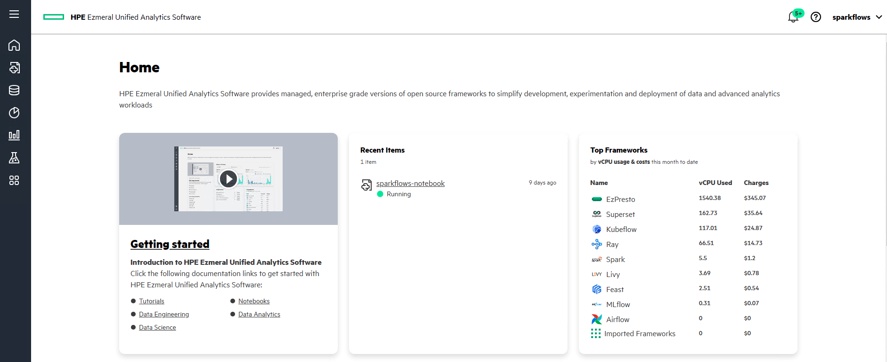
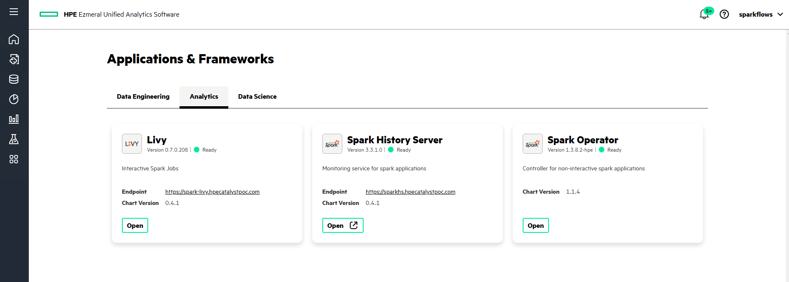
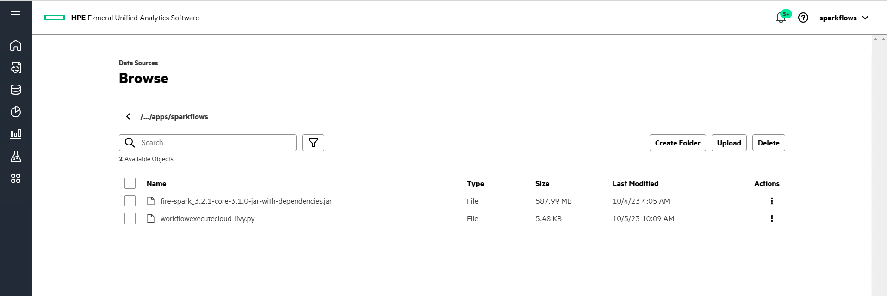
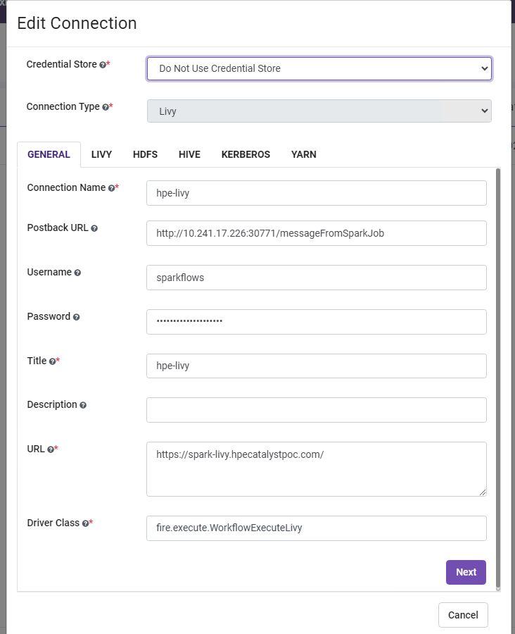
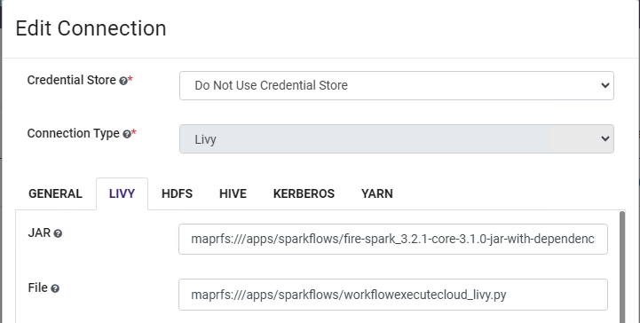

HPE Unified Analytics Admin Guide
===================

HPE Unified Analytics provides a platform for different distributed systems like datastore, analytics engine, scheduler and query engine for running different analytical operations. Sparkflows leverages 
these frameworks and tools to help you build ML and analytical workflows using drag-n-drop wizard.

Here is quick snap, of how the HPE UA Dashboard looks like.

Once you get access to the HPE UA Dashboard, you can go to **Main Menu** > **Applications & Frameworks** > **Analytics** to view the different frameworks and tools available that Sparkflows leverages for executing
the workflows.

Setup Sparkflows on HPE UA
--------------------------

1. Now with the sparkflows tar file, you need to extract it, and copy the **fire-spark_3.2.1-core-3.1.0-jar-with-dependencies.jar** and **workflowexecutecloud_livy.py** to the maprfs, 
with the support from HPE team. Once you have uploaded the files, you can view them, by navigating to **Main Menu** > **Data Engineering** > **Data Sources** > **Browse** 

Here is the screenshot

2. Use the Helm chart to install the Sparkflows, from one of the edge node of the HPE UA. Make sure you’ve configured the sparkflows deployment.yaml stored in the helm chart directory with the correct MySQL instance configuration.
If there is an instance of Sparkflows running, first uninstall it using the below command

::

  $ helm uninstall fire-ezua -n sparkflows

Run the command to install Sparkflows with MySQL support, in a separate namespace - sparkflows

::

  $ helm install fire-ezua -n sparkflows fire

To validate if the installation was successful, run the following command

::

  $ kubectl get pods -n sparkflows 
  NAME                                              READY   STATUS    RESTARTS       AGE
  fire-ezua-sparkflows-fire-7746b99c89-2kdhr        2/2     Running   1 (174m ago)   175m

To fetch the logs for debugging purpose, run the following command

::

  $ kubectl logs -f <pod name> -n sparkflows

Find the exposed service port by running this command

::
  
  $ kubectl get svc -n sparkflows

Livy Connection
-------------------
Sparkflows connects with Livy to submit the Spark jobs of the workflow on the cluster powered by HPE UA. Follow the below steps to configure the Livy connection in Sparkflows:

1. Navigate to **Administration** > **Connections** > **Add Connection** > **Connection for All**. You will be presented by the following modal window, where you need to enter the Livy URLs and the credentials, that has been provided by the HPE UA Team.

2. Upload the JAR(fire-spark_3.2.1-core-3.1.0-jar-with-dependencies.jar) that will be used to run the Spark job in the maprfs. You also need to upload the **workflowexecutecloud_livy.py** to the maprfs and configure the path in the Livy Tab, as shown below.

In the above configuration, you also need to update the docker image that will be used for running the pyspark jobs. If you are connecting to the S3 compatible storage, which doesn't have verified SSL certificate, then to ignore the ssl validation, you need to add the following configuration

::

  spark.driver.extraJavaOptions:-Dcom.amazonaws.sdk.disableCertChecking=true,spark.executor.extraJavaOptions:-Dcom.amazonaws.sdk.disableCertChecking=true,spark.kubernetes.container.image:sparkflows/fire-hpe:3.1.0_13

3. Finally test the connection and save it. Now you can start submitting the workflows on the Livy cluster.
