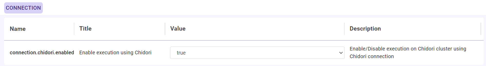
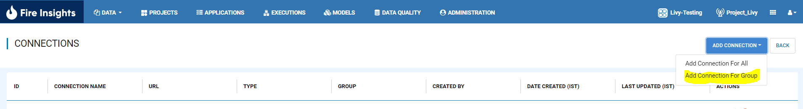
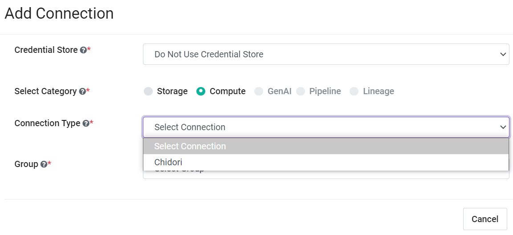
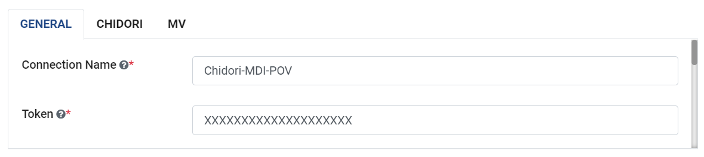
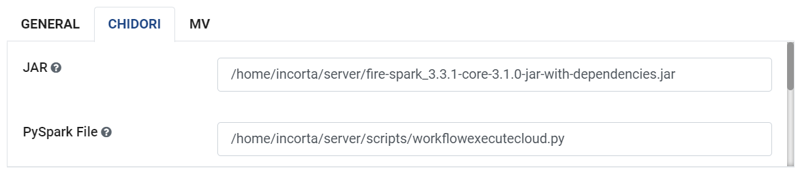
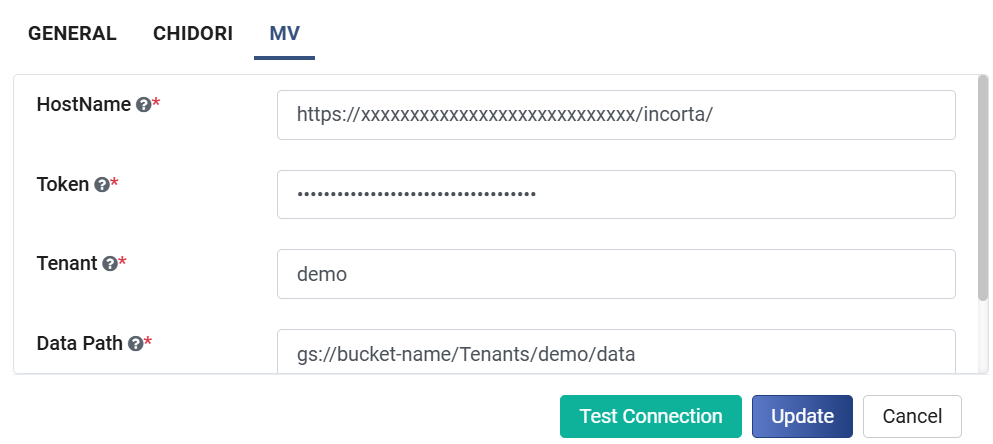

Configure Chidori Connection
=====================

Sparkflows enables you to create "Chidori Connection" and use it to submit jobs/workflows. Connections can be at various levels:

  * Global  : Everyone has access to these connections.
  * Group   : Users belonging to the group have access to these connections.
  * Project : The owner of the project and the groups with which the project has been shared with have access to the project level connections.

This page show how to create a "Chidori Connection" in Fire Insights.

Enable Chidori in Sparkflows
===========

Login to ``Sparkflows`` application -> ``Administration`` -> ``Configurations`` -> ``Connection`` -> and enable Chidori connection by setting the below parameter:

::

    connection.chidori.enabled	 : true

Navigate to Add Connections
===========

Once you save the above Configuration, navigate to ``Administration`` -> ``Global Connections`` -> ``Add Connections`` as shown below:

.. figure:: ../../_assets/aws/livy/administration.png
   :alt: livy
   :width: 60%
   
Add connection for group
========

Navigate to ``Administration`` -> ``Global Connections`` -> ``Add Connections`` -> ``Add Connection For Group`` which pop up a new windows -> Select ``Compute Connection`` and other parameters as shown below:

   

   
Add additional parameters as per your environment
======

Once you have selected  the connection type & groups, add the additional connection parameters needed. For more details refer the following tables and images:

For GENERAL tab
++++

.. list-table:: 
   :widths: 10 20 30
   :header-rows: 1

   * - Title
     - Description
     - Value
   * - Connection name
     - Connection Name
     - Name of Connection
   * - Token 
     - Token 
     - Token used for Chidori
   * - Postback Url
     - Postback Url
     - Postback Url through which Chidori sent result back to Fire Insights
   * - Title 
     - Title of Selected Connection
     - Title of Selected Connection  
   * - Description 
     - Connection Description 
     - Connection Description
   * - Url
     - Url for selected Connection type
     - Add URL for Chidori Connection
   * - Driver Class
     - Driver Class for selected Connection type 
     - It Comes with default value  
     

For CHIDORI tab
++++++
.. list-table:: 
   :widths: 10 20 30
   :header-rows: 1

   * - Title
     - Description
     - Value
   * - Jars
     - Jars to be used in Chidori session
     - Jars path located in Chidori Cluster
   * - Pyspark Files
     - Pyspark Files to be used in emr livy session
     - Pyspark file located in Chidori Cluster 
   * - Spark Conf
     - Spark Conf
     - Spark Conf used while Job Submission
   * - Log File location
     - Location to be used to store Chidori Log
     - Update the path ie File system accessible  
     

For MV tab
++++++
.. list-table:: 
   :widths: 10 20 30
   :header-rows: 1

   * - Title
     - Description
     - Value
   * - HostName 
     - HostName 
     - HostName 
   * - Token
     - Token
     - Token 
        

.. Note:: Make sure to upload ``fire-spark_x.y.z-core-x.y.z-jar-with-dependencies.jar`` & "workflowexecutecloud.py" to S3 bucket and is accessible from Saprkflows webserver UI. This jar is available in Sparkflows binary. Untar the binary to find it inside ``fire-x.y.z/fire-core-lib`` & ``fire-x.y.z/dist/``. 

