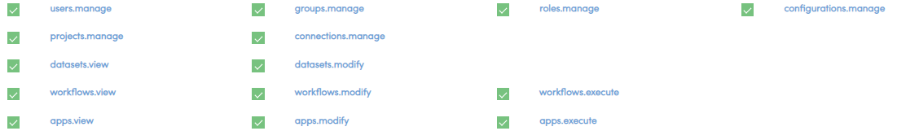

User Administration
===================

Fire allows you to create and manage

* Users
* Groups
* Roles

These are accessible under the Administration Menu.

Users
-----

* Fire allows you to create and edit users
* Users belong to groups and have roles
* A user can be a designated as a superuser
* The user should exist on HDFS (when running against a Hadoop Cluster). Fire can run independent of a Hadoop Cluster.
 
Groups
------

* Fire allows you to create and edit groups
* Groups allow users to share Datasets, Workflows and Dashboards with other groups
 
Roles
-----

* Fire allows you to create and edit roles.
* A role has various permissions associated with it.

Permissions
-----------

Fire has the following permissions defined.

