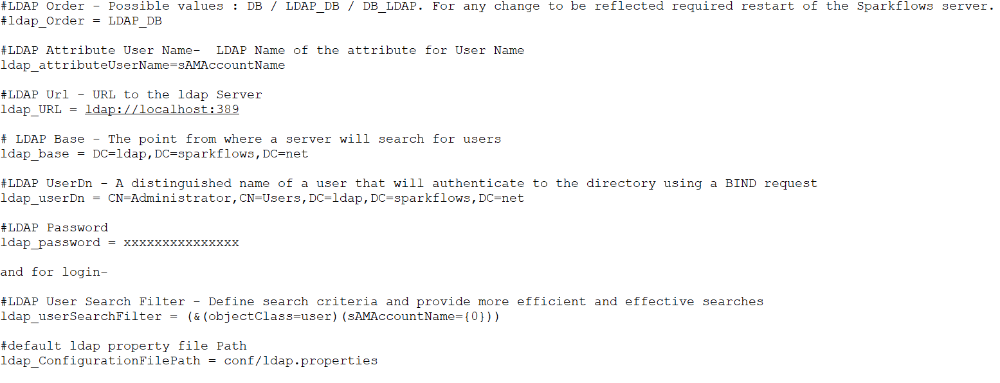
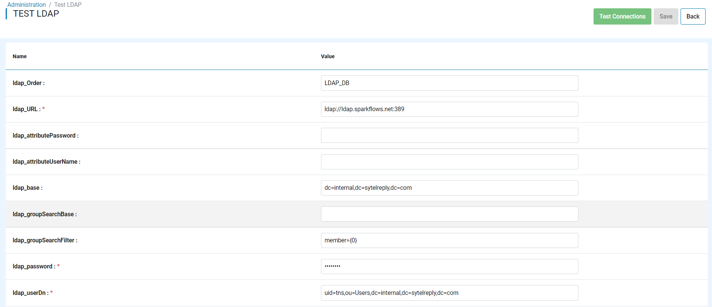
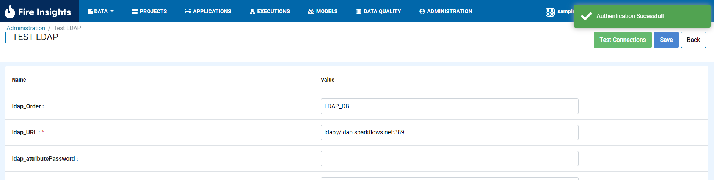

LDAP Authentication
===================

Sparkflows can be configured to authenticate the user against LDAP. Users have to be added and then they can start using Sparkflows.

The following configuration parameters have to be set in ``ldap.properties`` file inside ``conf`` folder in the home directory.

   
   

LDAP Parameters
---------------

Below are the parameters which need to be set to the appropriate values based on the LDAP directory being autheticated to

.. list-table::
   :widths: 10 30 15
   :header-rows: 1

   * - Name of Parameter
     - Description
     - Example
   * - ldap_Order
     - Order in which to authenticate the user. Possible values are DB, LDAP_DB, DB_LDAP.
     - LDAP_DB
   * - ldap_attributeUserName
     - LDAP Name of the attribute for User Name.
     - sAMAccountName  
   * - ldap_URL
     - The URL of the LDAP server. The URL must be prefixed with ldap:// or ldaps://. The URL can optionally specify a custom port, for example: ldaps://ldap_server.example.com:1636.
     - ldap://localhost:10389
   * - ldap_base
     - The distinguished name to use as a search base for finding users and groups. This should be similar to ‘dc=sparkflows,dc=com’.
     - dc=sparkflows,dc=com
   * - ldap_userDn
     - Distinguished name of the user to bind as. This is used to connect to LDAP/AD for searching user and group information. This may be left blank if the LDAP server supports anonymous binds.
     - uid=john,ou=development,dc=sparkflows,dc=com
   * - ldap_password
     - The password of the bind user.
     - xxxxxxxx
   * - ldap_userSearchFilter
     - The base filter for searching for users. For Active Directory, this is typically ‘(objectClass=user)’.
     - (&(objectClass=user)(sAMAccountName={0}))
   * - ldap_ConfigurationFilePath
     - default ldap property file Path
     - conf/ldap.properties

.. note:: Make sure to update the localhost with your domain name or ip which is accessible from Sparkflows machine

Test LDAP
------

Sparkflows provides the capability to test the LDAP conifguration from UI.

* Admin needs to place a file by name ``ldap.properties`` in the sparkflows ``HOME/conf`` directory to enable the ``Administration/Test LDAP`` functionality in the UI.
* Now, the Admin can use this to test out the LDAP configuration and finalize it. 
* Once the correct configuration is figured out, admin needs to place the same configuraions in the ``ldap.properties`` and restart the server. 
* Now, the admin can login to Sparkflows web URL and go to ``Administration/Test LDAP`` and Click on ``Test Connections``, and it should authenticate successfully.

     
.. note:: For ``ldap.UserSearchFilter`` we can use strings like ``(uid={USERNAME})``  
In this case {USERNAME} would be replaced by the real username of the user when searching in LDAP during ``Add User``.
     
LDAP Certificate
----------------

If ``ldaps`` is being used, the ldap certificate needs to be imported into cacerts.

For Reference : https://docs.oracle.com/cd/E19509-01/820-3399/ggfrj/index.html

Importing a user from LDAP into Sparkflows
------------------------------------------

Once LDAP is enabled in Sparkflows, users can be imported into Sparkflows from LDAP.

* Go to Administration/User
* Click on Add/Sync User
* Enter the username and click on Search
* User details are fetched from LDAP
* Click on Add User to create the user in Sparkflows

Above steps will create the LDAP user in Sparkflows database and user deatils can be edited later to provide the access to roles in  different groups etc.

Search Order
-----------

Search order is determined by the parameter ``ldap_Order``.

If it is set to ``LDAP_DB``, it would first search for the User in LDAP and then in its own DB. This enables the admin user to have an entry in the Sparkflows DB, so that all users are not locked out of the system in case LDAP goes down or ends up with invalid Configurations.

User Login
----------

Once the LDAP is configured, the users would be authenticated with LDAP and admin account will get authenticated with DB.

Reference
---------

Below are some great links for reference:

* Active Directory Search Filter Syntax : https://msdn.microsoft.com/en-us/library/aa746475(v=vs.85).aspx

What if I get locked out
------------------------

``ldap_Order`` determines the order in which Sparkflows tries to log in the user.
In case you are locked out of Sparkflows and are not able to log in, you can do the following:

* Comment out ``ldap_Order = LDAP_DB`` in ``/conf/ladp.properties`` and restart the fire server.

* Then restart the Sparkflows server. Now you should be able to log in with your admin account.

Once things are back to normal, you can enable ``ldap_Order = LDAP_DB`` in ``/conf/ldap.properties`` and restart the fire server.

