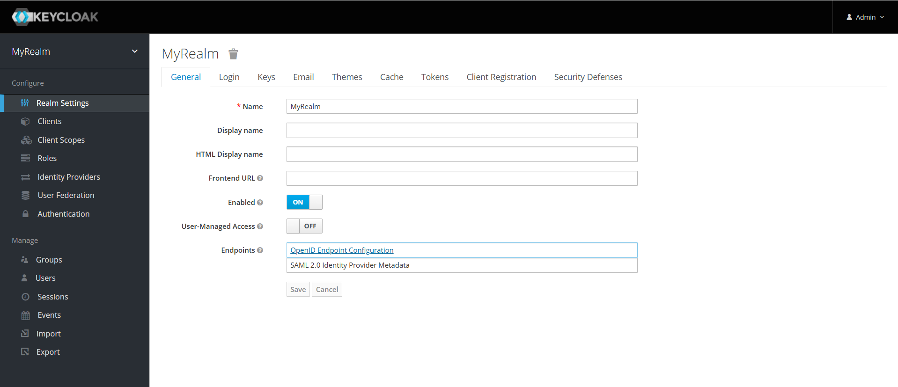
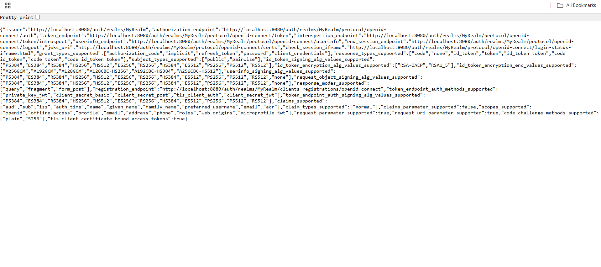

OAuth Authentication
====================

Sparkflows supports OAuth Authentication.

Below are Pre-Requisites to Configure OAuth in Sparkflows.

Pre-requisites
--------

#. Sparkflows host URL must be available for setting up OIDC callback URL in application setup in OAuth
#. oauth.client.clientId
#. oauth.client.clientSecret
#. oauth.client.accessTokenUri
#. oauth.client.userAuthorizationUri
#. oauth.resource.userInfoUri
#. oauth.client.redirectUri
#. oauth.client.issuerUri
#. oauth.client.jwkSetUri

.. note::  Make sure to update ``OIDC callback URL`` as ``https://<sparkflows-host>/login/oauth``.

Configuring OAuth in Sparkflows
-----------------

In order to configure OAuth in Sparkflows, add the OAuth configuration parameters to ``conf/application.properties``.

Below is an example of configuring OAuth in Fire with Okta:

::

  # OAuth settings
  oauth.client.clientId: 0oadvfdsfsdA7Y68356
  oauth.client.clientSecret: YSWFdZf9kfdsfsdfsdfsdnI0SVrswOJpHl
  oauth.client.accessTokenUri: https://xyz.okta.com/oauth2/default/v1/token
  oauth.client.userAuthorizationUri: https://xyz.okta.com/oauth2/default/v1/authorize
  oauth.client.clientAuthenticationScheme: form
  oauth.client.scope: openid profile offline_access
  oauth.resource.userInfoUri: https://xyz.okta.com/oauth2/default/v1/userinfo
  oauth.client.redirectUri: https://Sparkflows_url/authorization-code/callback
  oauth.client.issuerUri: https://dev-69877250.okta.com/oauth2/default
  oauth.client.jwkSetUri: https://dev-69877250.okta.com/oauth2/default/v1/keys

Update sso.saml.properties 
-----------------

In order to configure OAuth in Sparkflows, update ``conf/sso.saml.properties`` with below parameter:

::

    #enable/disable sso by set the value true or false
    sparkflows.sp.sso.enable=true

    #authentication type - expected value (saml or oauth)
    sparkflows.authentication.type=oauth

    #Enable/disable user auto creation in local database. If user is not present in local database and auto creation is true
    sparkflows.sp.auto.user.create=true

    #disable the db login for admin also.
    sparkflows.sp.db.login.enable=true

Getting all the required properties for Keycloak server
-------------------------------------------------------
When using Keycloak as the OAuth provider, you need to fetch the below properties from your Keycloak server.

- **oauth.client.clientId**  
  Go to **Clients → your-client → Settings → Client ID**.

- **oauth.client.clientSecret**  
  Go to **Clients → your-client → Credentials → Client Secret**.

- **oauth.client.accessTokenUri**  
  URL format:  
  ``https://<keycloak-host>/realms/<realm-name>/protocol/openid-connect/token``

- **oauth.client.userAuthorizationUri**  
  URL format:  
  ``https://<keycloak-host>/realms/<realm-name>/protocol/openid-connect/auth``

- **oauth.resource.userInfoUri**  
  URL format:  
  ``https://<keycloak-host>/realms/<realm-name>/protocol/openid-connect/userinfo``

- **oauth.client.redirectUri**  
  Set this in Keycloak under **Clients → your-client → Settings → Valid Redirect URIs**.  
  Example:  
  ``https://<sparkflows-host>/authorization-code/callback``

- **oauth.client.issuerUri**  
  URL format:  
  ``https://<keycloak-host>/realms/<realm-name>``

- **oauth.client.jwkSetUri**  
  URL format:  
  ``https://<keycloak-host>/realms/<realm-name>/protocol/openid-connect/certs``

.. note::  
   - Replace ``<keycloak-host>`` with your Keycloak server hostname (e.g., ``https://localhost:8443``).  
   - Replace ``<realm-name>`` with the Keycloak realm where your client is configured.  
   - Ensure **Standard Flow Enabled** is turned on in Keycloak client settings. 

Once the Keycloak realm is configured, click on Endpoints to view the realm details and retrieve the required properties listed above.

Start Fire Insight 
--------------

Once the above Configuration are updated and saved, Start the Sparkflows application and Type Sparkflows host URL in web browser and try login using option ``Login with SSO``.

.. note::  Make sure that user trying to login should have access.

