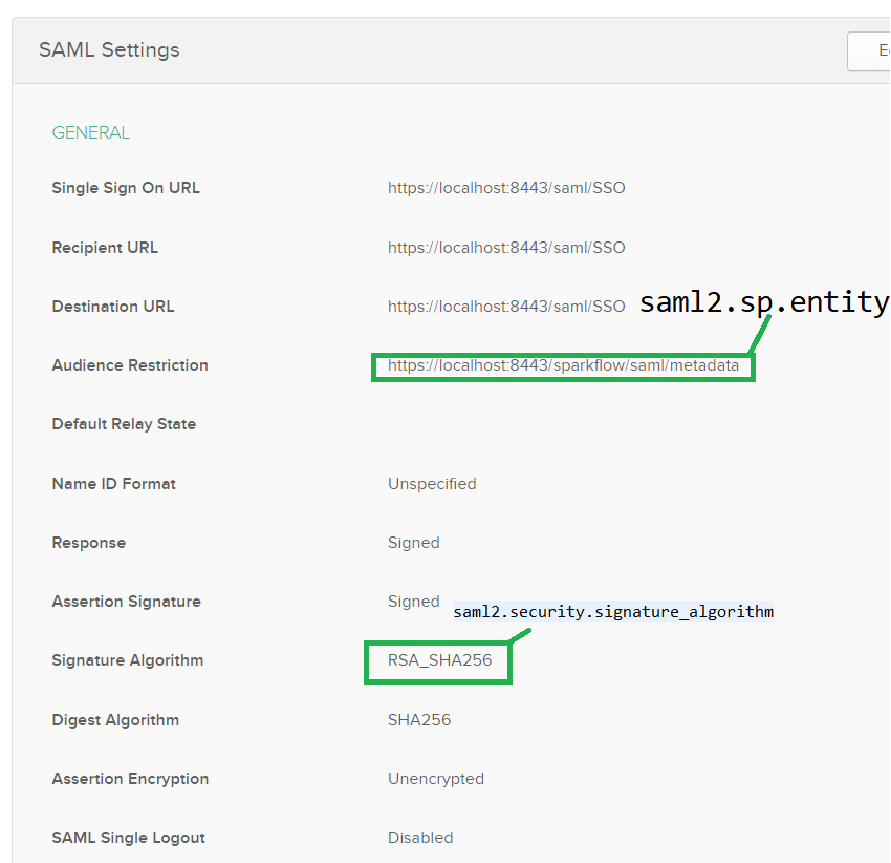
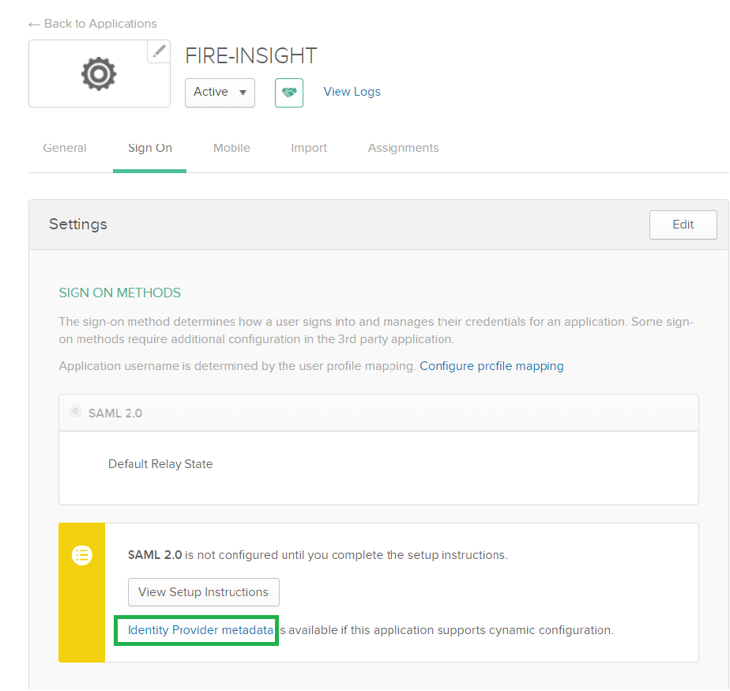
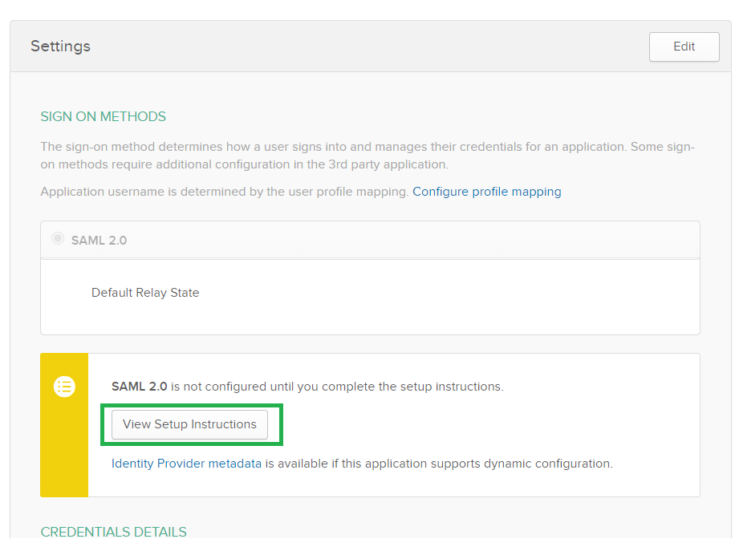
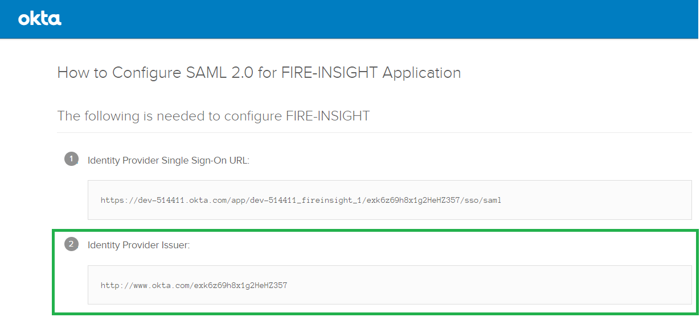

Okta Fire Insights SAML Configuration
====================

Fire Insights can be configured with SAML 2.0 Okta as below:

Go to folder ``conf`` and edit the file ``sso.saml.properties`` in it:

Add/update the below information from newly created application in Okta:

1. Enable SSO in Fire Insights.

::

    sparkflows.sp.sso.enable=true 
    
2. Create user automatically in application, if user doesn't exist in Fire Insights, otherwise app will show page 'User not found'.

::

    sparkflows.sp.auto.user.create=true 
    
3. Disable the DB login for superuser or else you can enable it to login with superuser authentication.

::

    sparkflows.sp.db.login.enable=true

4. Enable/disable global logout.

::

    saml2.global.logout=true
    
    
5. Copy Okta config info.

::

    # Identifier of the SP entity  (must be a URI) Audience URI
    saml2.sp.entityid=https://localhost:8443/sparkflow/saml/metadata
    # Algorithm that the toolkit will use on signing process
    saml2.security.signature_algorithm=http://www.w3.org/2001/04/xmldsig-more#rsa-sha256

6. Right click on identity provider metadata and select Copy link address.

::

    #Metadata URL of identity provider
    saml2.idp.metadata-url=https://dev-514411.okta.com/app/exk6sc27dyq4istqO357/sso/saml/metadata
    
    

7. Capture Issuer URL:

8. Algorithm that the toolkit will use in signing process.

::

  saml2.security.signature_algorithm=http://www.w3.org/2001/04/xmldsig-more#rsa-sha256

9. Application base URL.

::

  saml.sso.metadata-generator.entity-base-url=https://localhost:8443
  
10. Server name.

::

  saml.context.lb.server-name=localhost:8443
  saml.context.lb.scheme=https
  saml.context.lb.contextPath=/  
  
.. note::  Make sure to change localhost to your domain name or your IP.    
