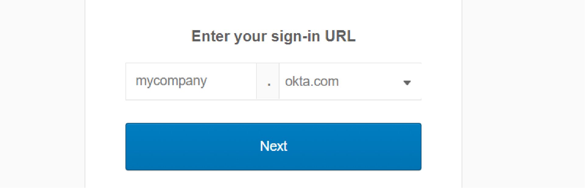
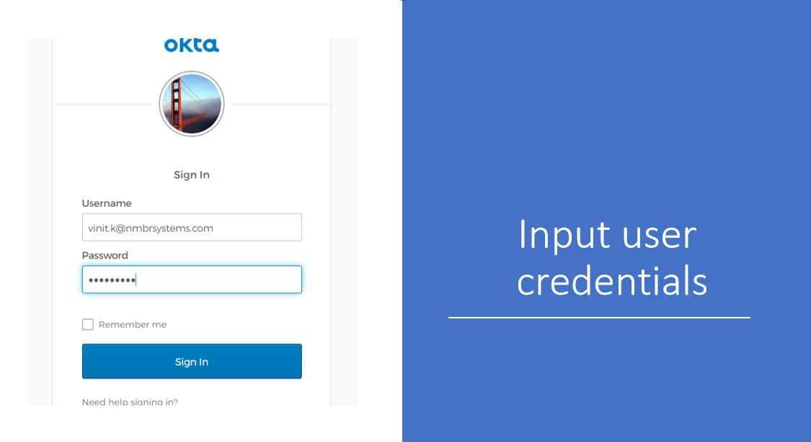
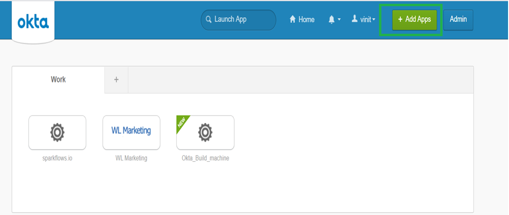
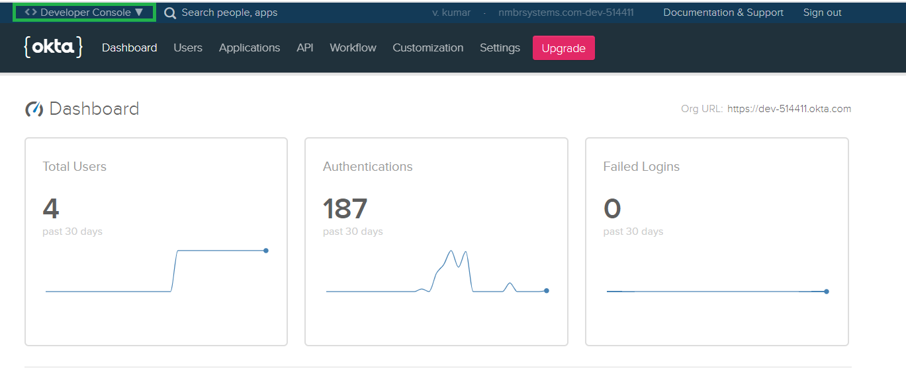
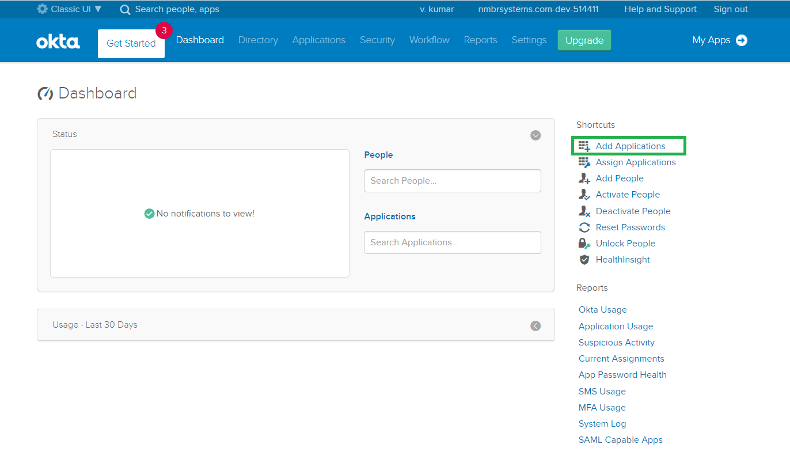
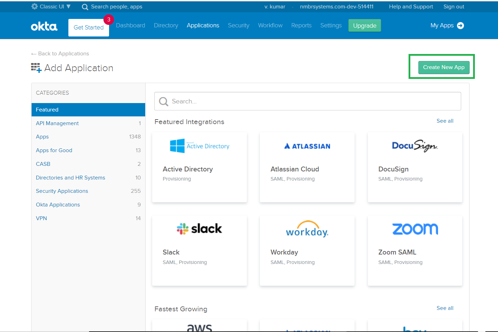
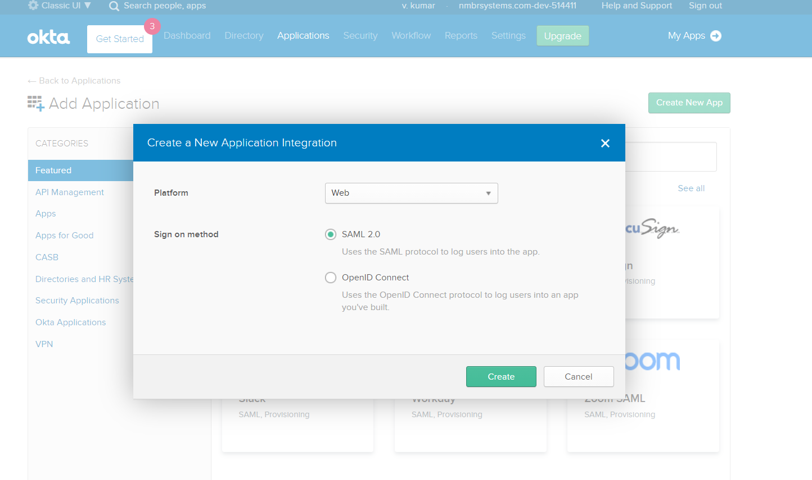
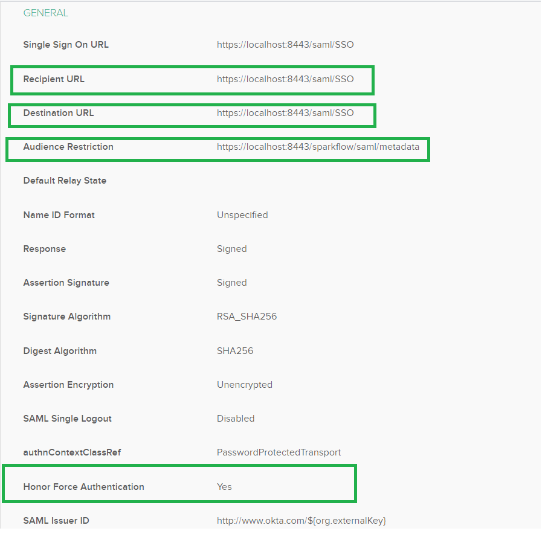
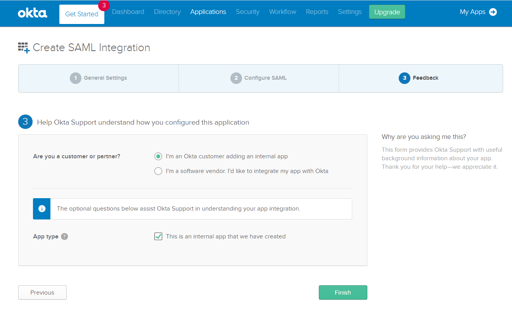

Okta SAML Setup
==============

Below are steps to setup SAML 2.0 Okta

1. Create an account in Okta.

   
2. SignIn into Okta.

   
3. After login go to home and Click on Admin.   

4. Click on Developer Console.

   
5. Add an App:

6. Create New App:

7. Select SAML 2.0:

   
8. Input app name and click next:

.. figure:: ../../../_assets/authentication/okta_config.png
   :alt: sso
   :width: 60%

9. Configure the newly created app and add below information.

10. Click finish.

   
   
.. note::  Make sure to change localhost to your domain name or your IP where Fire is Running.
