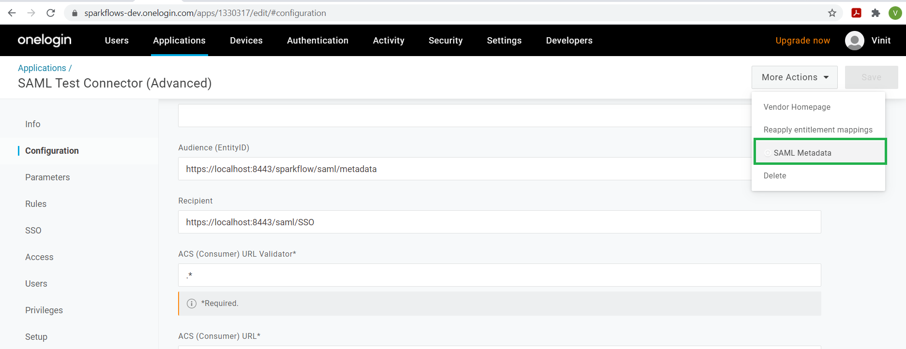
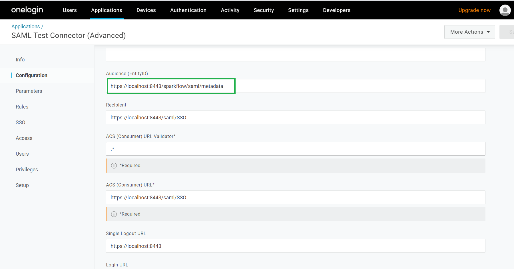
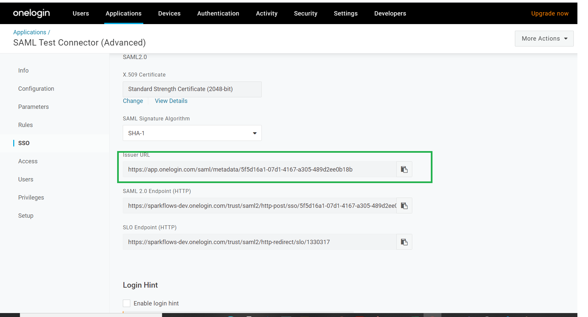
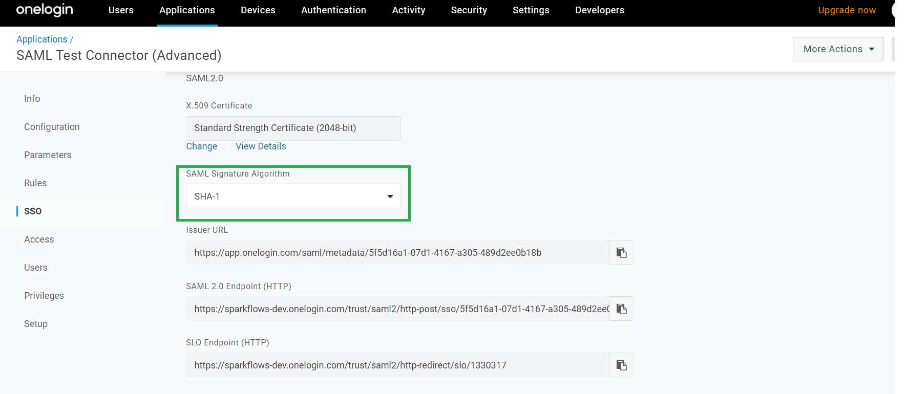

OneLogin Fire Insights SAML Configuration
====================

Fire Insights can be Configured with SAML 2.0 OneLogin as below.

Go to folder ``conf/sso.saml.properties`` file:

Add the below information from newly created application in oneLogin:

1. Enable sso in sparkflows::

    sparkflows.sp.sso.enable=true 
    
2. Create user locally in application if user doesn't exist in Fire Insights, otherwise app will show page 'User not found'::
    
    sparkflows.sp.auto.user.create=true 
    
3. Disable the DB login for superuser or else you can enable it to login with superuser authentication::

    sparkflows.sp.db.login.enable=true

4. Enable/Disable global logout::

    saml2.global.logout=true
    
5. Metadata URL of identity provider.

::  
  
  saml2.idp.metadata-url=https://sparkflows-dev.onelogin.com/saml/metadata/5f5d16a1-07d1-4167-a305-489d2ee0b18b
    
6. Identifier of the SP entity  (must be a URI) Audience URI
		        

::

   saml2.sp.entityid=https://localhost:8443/sparkflow/saml/metadata
   
7. Identifier of the IdP entity  (must be a URI)
  
   

::

  saml2.idp.entityid=https://app.onelogin.com/saml/metadata/5f5d16a1-07d1-4167-a305-489d2ee0b18b

8. Algorithm that the toolkit will use on signing process.

  

::

  saml2.security.signature_algorithm=http://www.w3.org/2001/04/xmldsig-more#rsa-sha1

9. Application base URL

::

  saml.sso.metadata-generator.entity-base-url=https://localhost:8443
    
10. Server Name

::

  saml.context.lb.server-name=localhost:8443
  saml.context.lb.scheme=https
  saml.context.lb.contextPath=/
 

.. note::  Make sure to change localhost to your domain name or your IP.

