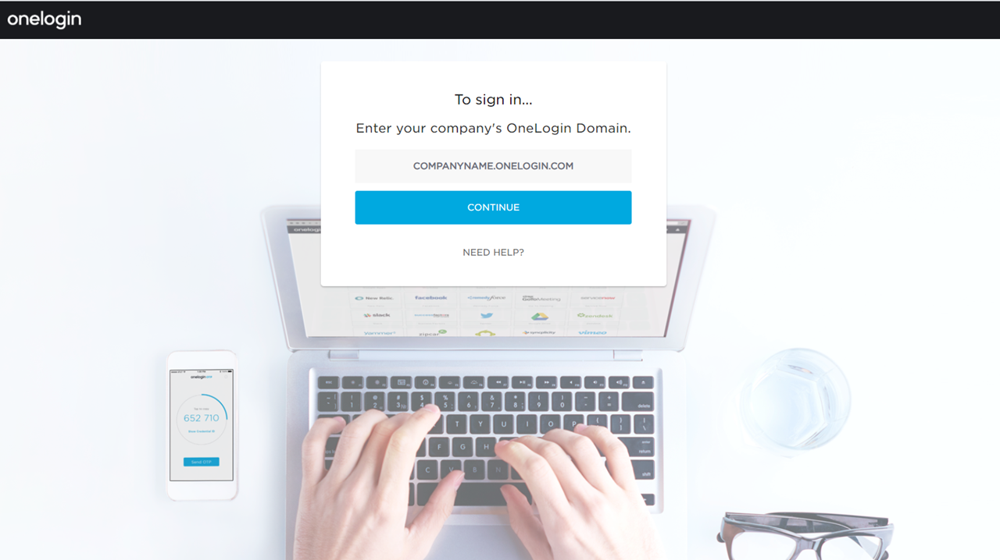
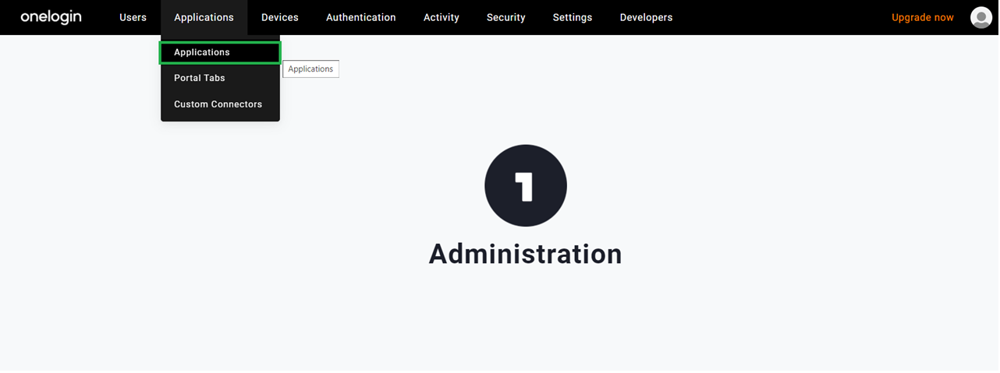
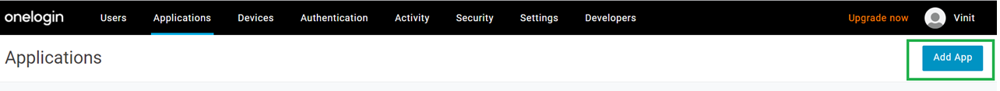
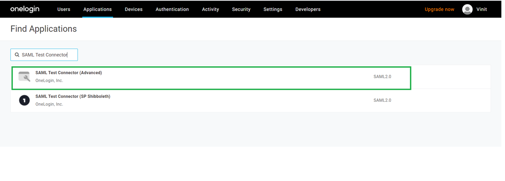
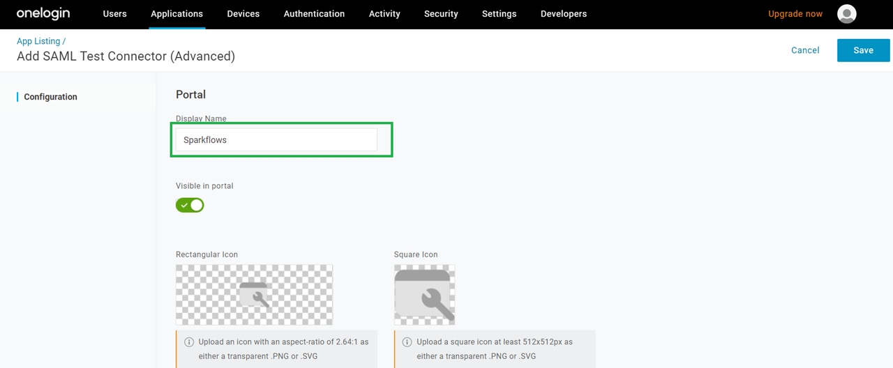
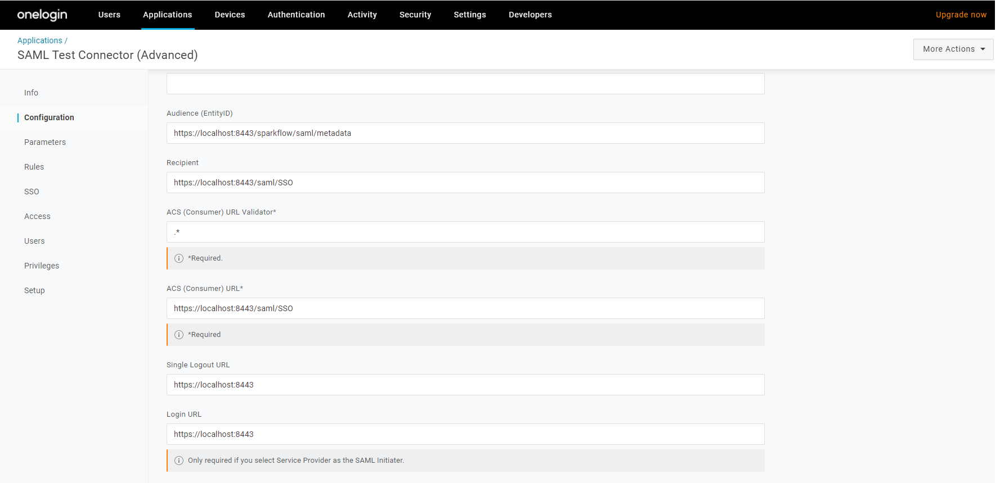

OneLogin SAML Setup
==============

Below are steps to setup SAML 2.0 OneLogin:

1. Create an account at OneLogin. 
2. Sign in to oneLogin.

	   
3. Go to Administrator >> Click on Applications menu >> 

	   
4. Add an app.

   
5. Select an application::

    Search application 'SAML Test Connector'.
    Select the application SAML Test Connector (Advanced).
      

	    
6. Input an application name and save it.

   
7. Configure the newly created app and add below information::

    Audience (EntityID)
    Recipient
    ACS (Consumer) URL Validator*
    ACS (Consumer) URL*
    Single Logout URL
    Login URL
	   

.. note::  Make sure to change localhost to your domain name or your IP, where Fire is Running.
