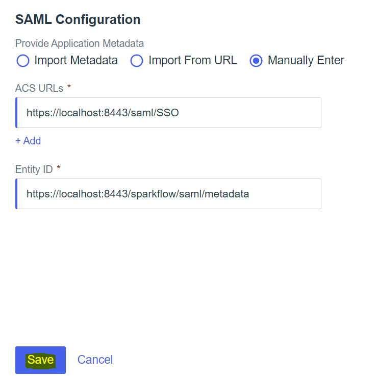

Ping Identity Setup
========

Below are steps to setup SAML 2.0 Ping Id

1. Create an account in Ping Identity

.. figure:: ../../../_assets/authentication/pingid/ping_id.PNG
   :alt: sso
   :width: 60%
   
2. SignIn into Ping Identity

.. figure:: ../../../_assets/authentication/pingid/ping_id_1.PNG
   :alt: sso
   :width: 60%

3. After login go to home and Click on Administrators in Environments

.. figure:: ../../../_assets/authentication/pingid/pingid_2.PNG
   :alt: sso
   :width: 60%

4. Click on Connections

.. figure:: ../../../_assets/authentication/pingid/pingid_3.PNG
   :alt: sso
   :width: 60%

5. Select Applications & Click on + Sign to Create new Application

.. figure:: ../../../_assets/authentication/pingid/pingid_4.PNG
   :alt: sso
   :width: 60%

6. Add Name and Descriptions of Application

.. figure:: ../../../_assets/authentication/pingid/pingid_5.PNG
   :alt: sso
   :width: 60%
   
7. Choose Application Type as SAML Application

.. figure:: ../../../_assets/authentication/pingid/pingid_6.PNG
   :alt: sso
   :width: 60%
   
7. Click on Configure and Provide Application Metadata as per your configurations

.. figure:: ../../../_assets/authentication/pingid/pingid_7.PNG
   :alt: sso
   :width: 60%
   
8. Save and Activate the application

   
9. Save and Activate the application

.. figure:: ../../../_assets/authentication/pingid/pingid_9.PNG
   :alt: sso
   :width: 60%
