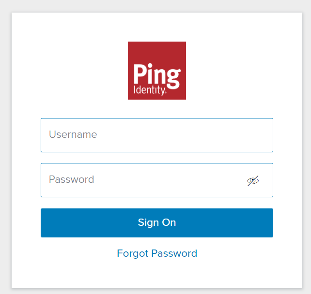
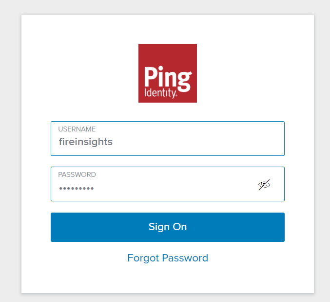
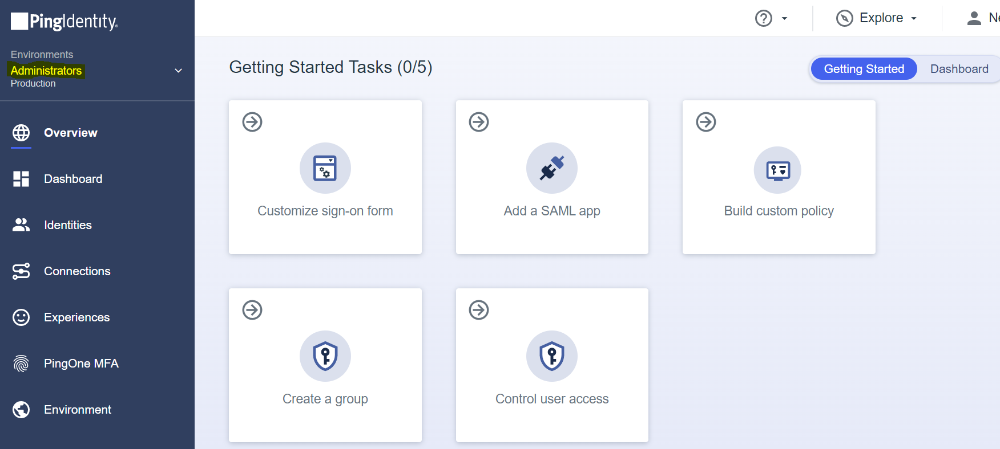
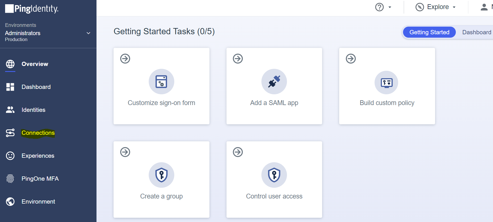
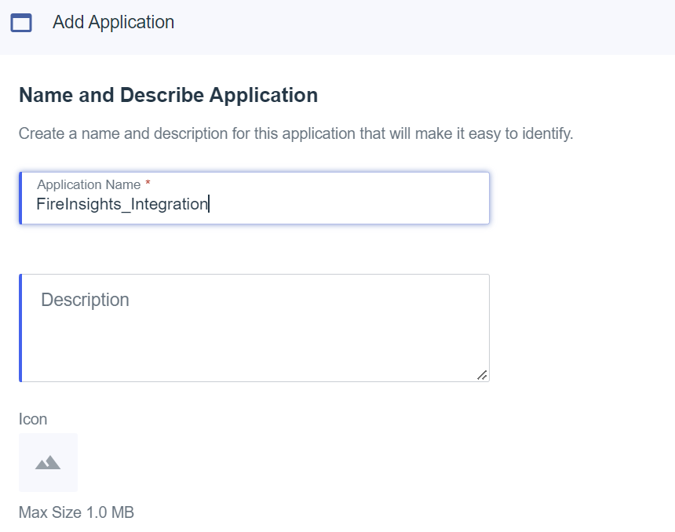
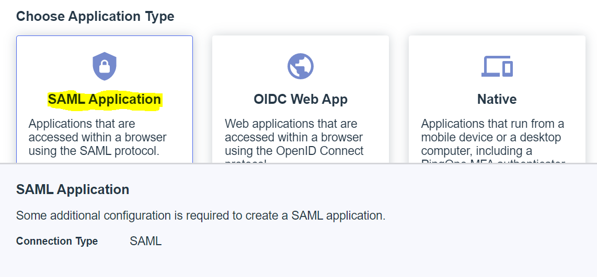
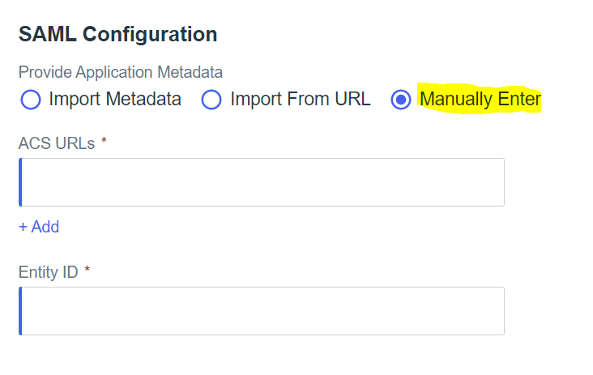
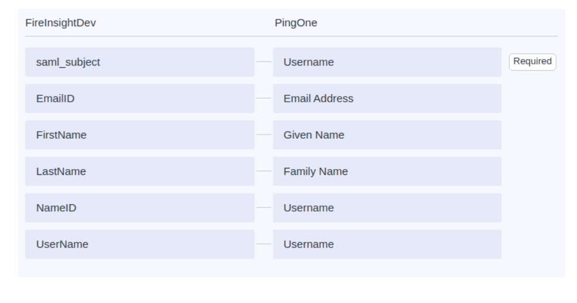
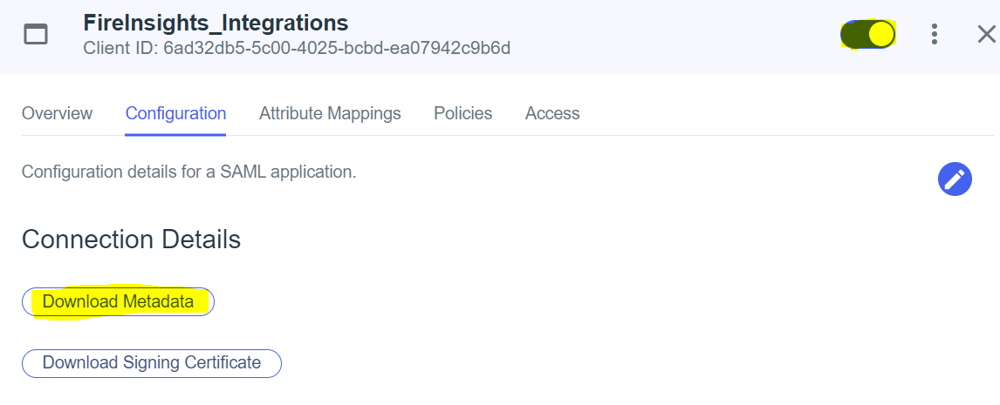

Ping Identity Setup
========

Below are steps to setup SAML 2.0 Ping Identity.

Create an account in Ping Identity
------

   
Sign On to Ping Identity
------

Go to ``Administrators`` in Environments
------

Click on ``Administrators`` in Environments.

Click on ``Connections``
------

Create new Application
------

Select ``Applications`` & click on ``+`` sign to create new application

.. figure:: ../../../_assets/authentication/pingid/pingid_4.PNG
   :alt: sso
   :width: 60%

Add ``Name`` and ``Description`` of the Application
------

   
Choose ``Application Type`` as SAML Application
------

   
Provide Application Metadata
------

Click on ``Configure`` and provide application metadata as per your configuration

   
Update ``ACS URLs`` and ``Entity ID`` and save the Application
------

.. figure:: ../../../_assets/authentication/pingid/ping_acs.PNG
   :alt: sso
   :width: 60%

Update ``HTTP POST`` and save
------

Click on ``Configure`` and Update ``HTTP POST : urn:oasis:names:tc:SAML:1.1:nameid-format:unspecified``

Update ``Attribute Mappings`` and save
------

Click on ``Attribute Mappings`` and Update ``saml_subject : Username`` and save

.. figure:: ../../../_assets/authentication/pingid/http_post.PNG
   :alt: sso
   :width: 60%

Download the metadata from Application
------

Activate the Application and download the metadata from application which will be used while configuring Fire Insights

.. note::  Make sure to change localhost to your domain name or your IP where Fire Insights is running.
