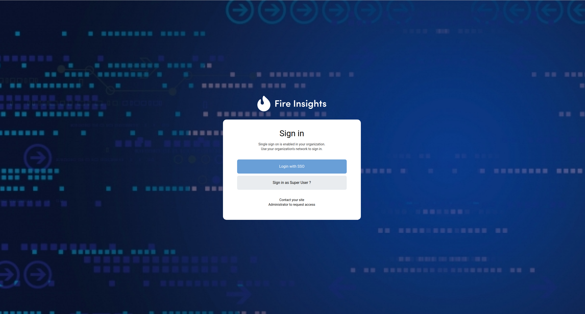
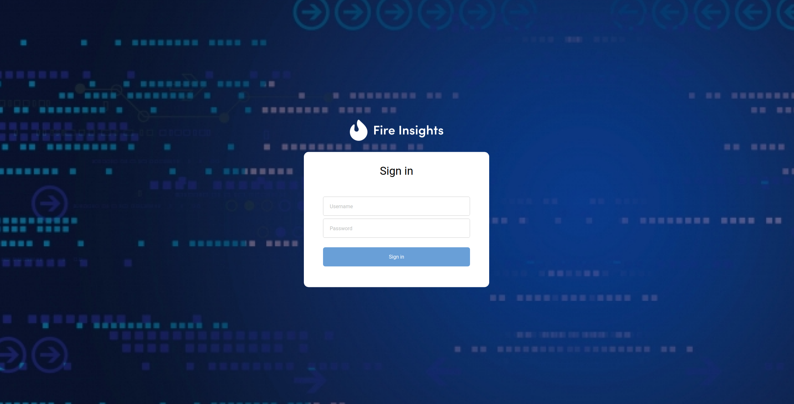

Super User login using database
==============

Fire Insights allows to enable super user login by changing in "sso.saml.properties" file.

::

    sparkflows.sp.db.login.enable=true

After enabling super user DB login, one more button appears on login page, after starting Fire Insights server.

	
	
Click on "Sign in as Super user" button.

::

   It will redirect you to "super user login form page".

On updating the username and password, click on "Sign In" button. ::

    On successful authentication, it will redirect user to home page of the Fire Insights application.
