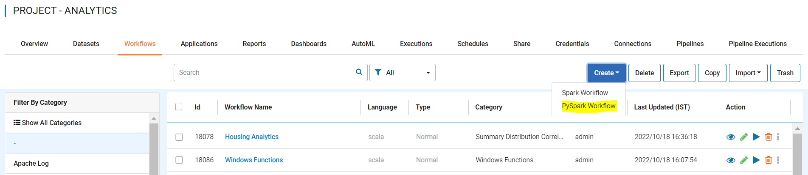

PySpark Configurations
========

Sparkflows can be configured to use the PySpark engine and create workflow using it.

Below are the Prerequisites Before Configuring PySpark engine in Sparkflows:

::

    Python 3.7+ 
    
    
Install the required python dependencies.

::

    cd fire-x.y.x/dist/fire
    pip install -r requirements.txt
    
''requirements.txt'' file is available in the installation directory of Sparkflows:

::

    fire-x.y.x/dist/fire/requirements.txt    
    
Once the above dependency got installed successfully, Login to Sparkflows webserver url and go inside ''ADMINISTRATIONS -->> Configurations'' and update below parameters:

::

    module.workflowTypes = both
    

.. figure:: ../../_assets/installation/pyspark_configurations.PNG
   :scale: 70%
   :alt: pyspark
   :align: center
    
Once the above configuration is updated and save the changes, you need to refresh the Sparkflows webserver url to verify the latest configuration changes.

Now open any project and select workflows tab, Click on ''Create'' button will show you option to create workflow using PySpark engine.

.. note:: Make sure to install all Sparkflows python dependency.

