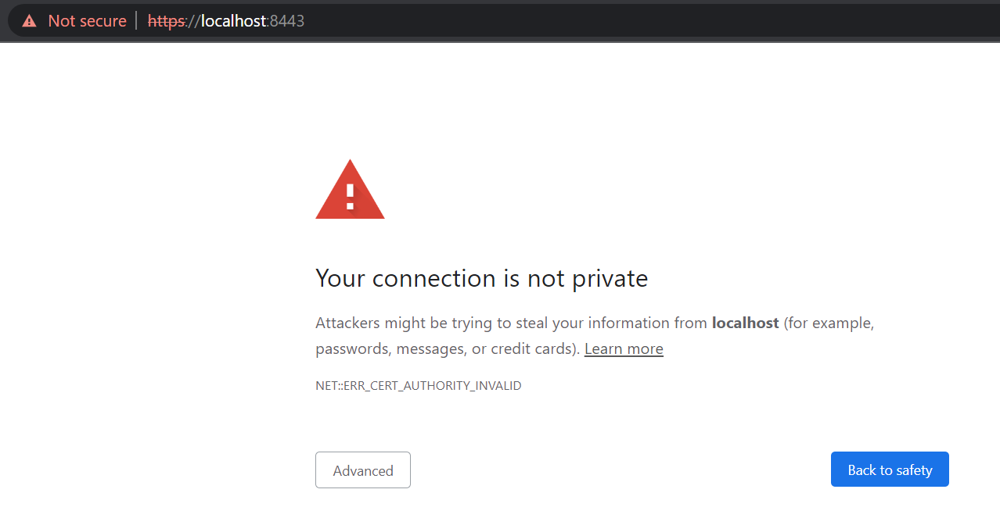
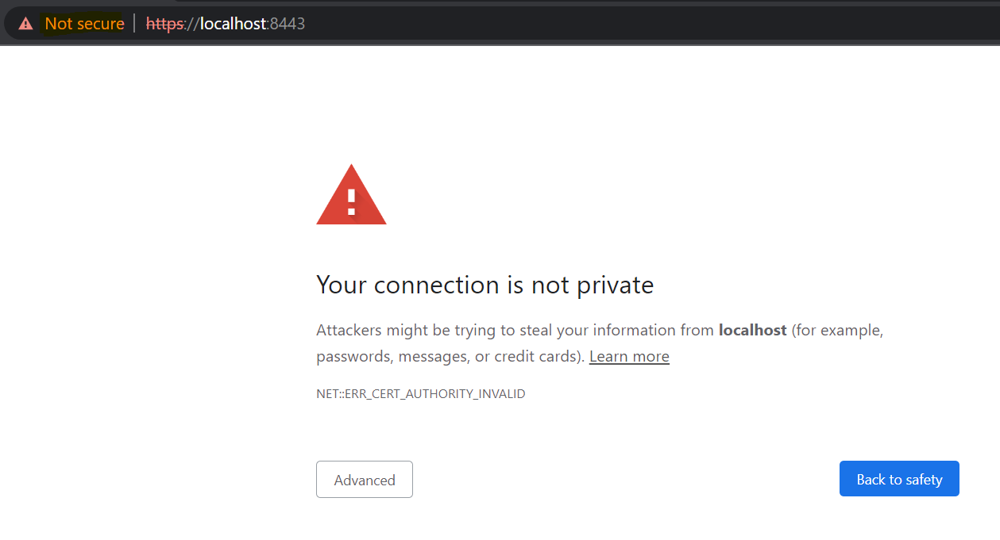
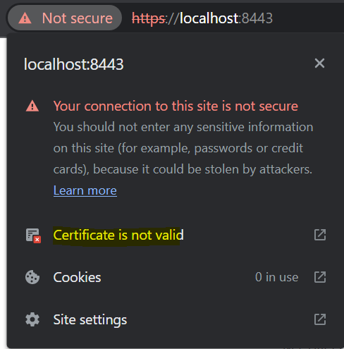
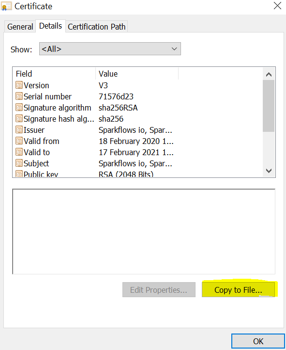
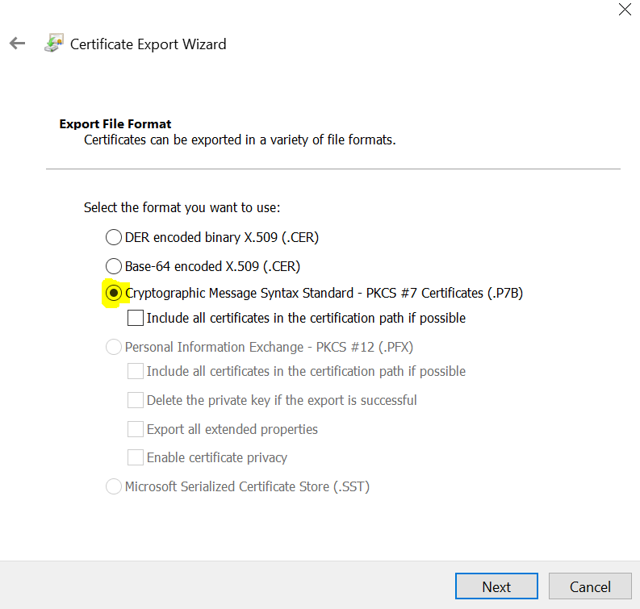
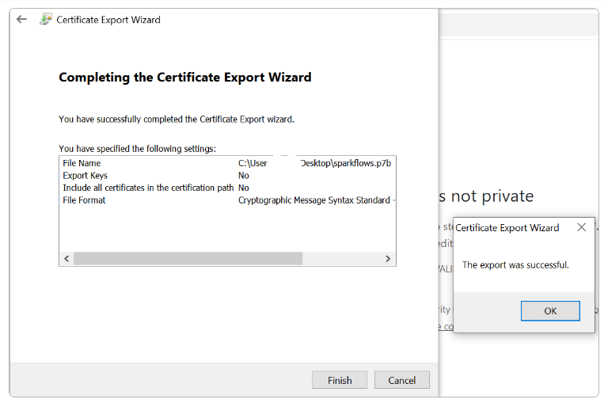
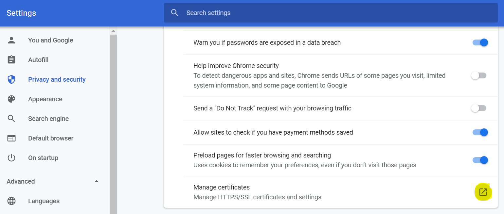
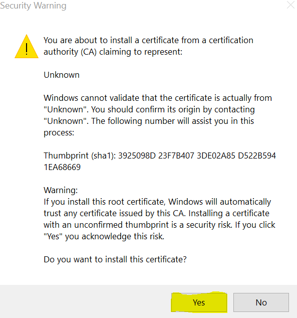
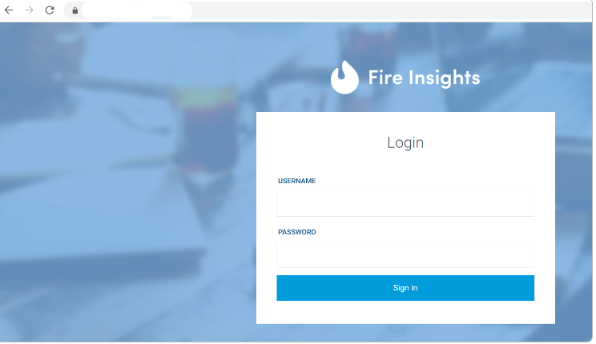

HTTPS : Import Self-Signed Certificates
================================

Fire Insights comes with a self-signed certificate. It is available in ``conf/keystore.jks`` of fire-x.y.z directory. 

While this allows for basic HTTPS encryption, **self-signed certificates are not trusted by browsers**, as they have not been issued by a recognized Certificate Authority (CA). This will trigger security warnings in the browser when accessing the application.

To suppress this warning message, you can import the self-signed certificate into the **Trusted Root Certification Authorities** section of  your browser by following the steps below. However, this approach is only recommended for **local development and testing**.

  .. warning:: **For production environments, it is strongly recommended to obtain a trusted SSL certificate from a CA** to ensure the highest level of security and trust for your users. Trusted SSL certificates enhance data integrity and builds user trust by removing browser warnings. You can follow out documentation for using SSL certificates from a CA here: https://docs.sparkflows.io/en/latest/installation/configuration/https/ssl-certificate.html

Below are the steps to import self-signed certificate into your browser:

Export Certificate to Machine
--------------------------------------------

Below are the steps to export the certificate to your machine.

Go to URL for the HTTPS port
+++++

https://host_name:8443/login

   
Select Not Secure
++++++

Click on ``Not secure`` option.

 

   
Click on Certificate
+++++

   
   

View Certificate
+++++

.. figure:: ../../../_assets/configuration/viewcertificate.PNG
   :alt: certificate
   :width: 45%

Click on Details
++++++

Click on ``Details`` option to see detailed information of certificate.

.. figure:: ../../../_assets/configuration/Certificatedetails.PNG
   :alt: certificate
   :width: 45%

Copy Certificate to local machine
+++++++

Click on ``copy to  file`` option to copy certificate to ``local machine``.

Choose file format
++++++

Select the below option and press ``Next``.

   
Choose Name and File Location
++++

Select the ``Name & file location`` of the certificate using browse button.

.. figure:: ../../../_assets/configuration/filelocation.PNG
   :alt: certificate
   :width: 45%

Success Message
++++++

On updation of details a ``Success message`` will be displayed on the screen.

Next, you need to add the exported certificate to the browser.

   
Adding Certificate to Browser
--------------------------

You can add certificate to the browser using **Google Chrome** by following the below steps:

* Open Google Chrome and go to Settings.

* Navigate to Settings -> Advanced -> Privacy and Security-> Manage Certificates.
   

.. figure:: ../../../_assets/configuration/managecertificate.PNG
   :alt: certificate
   :width: 45%

* Click on the ``Manage Certificates`` icon.

* Click on ``Import`` button.

.. figure:: ../../../_assets/configuration/import.PNG
   :alt: certificate
   :width: 45%

* Select ``certificate from local system``, then select ``Trusted Root Certification Authorities`` option and click on ``yes`` to save it.

.. figure:: ../../../_assets/configuration/Trustedroot.PNG
   :alt: certificate
   :width: 55%
   

.. figure:: ../../../_assets/configuration/successmsg.PNG
   :alt: certificate
   :width: 55%

* Once the above process is completed, close the browser and start again and try to login with above URL. It should work without any warnings.

   

* URL for further assistance: https://peacocksoftware.com/blog/make-chrome-auto-accept-your-self-signed-certificate 

