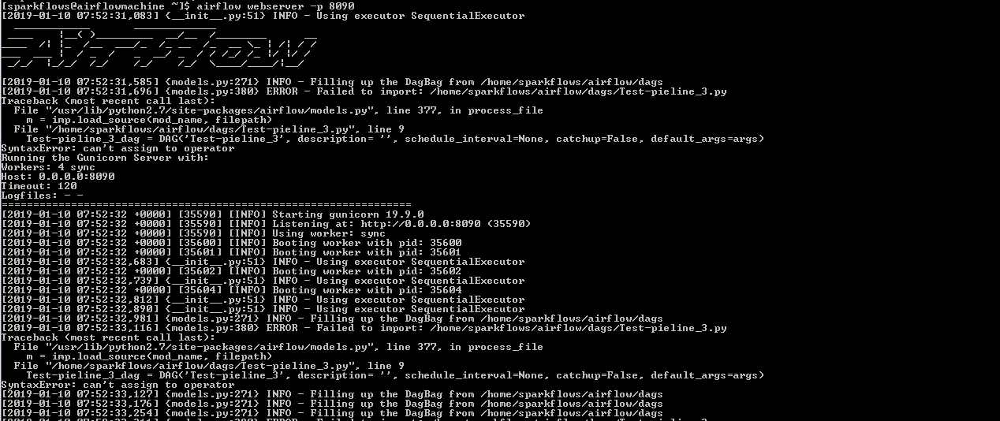
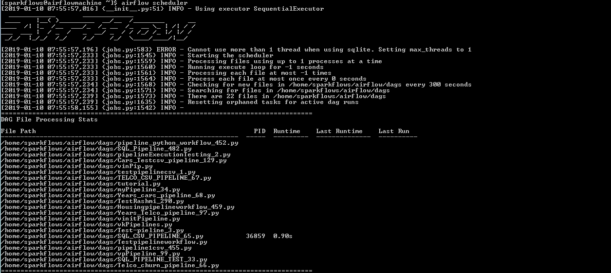

Airflow Installation
--------------------

Below are the steps for installing Airflow on Centos and RHEL. Detailed Airflow Install Instructions are at:

https://airflow.apache.org/installation.html

- Login to machine.

- Before installing Airflow, update installed package:
 - yum -y update
 
- Install python-pip and any required packages: 
 - sudo yum install epel-release
 - sudo yum install python-pip
 
- Check the version of pip that is installed and if read upgrade:
 - pip -V
 - pip install --upgrade setuptools
 
- Note that for 1.10 you now need to preface install commands or export this env var:
 - export SLUGIFY_USES_TEXT_UNIDECODE=yes
 
- Install gcc , gcc-c++ and dependencies for python 2.7: 
 - sudo yum -y install gcc gcc-c++ kernel-devel
 - sudo yum -y install python-devel libxslt-devel libffi-devel openssl-devel
  
- Airflow needs a home, ~/airflow is the default home:
 - export AIRFLOW_HOME=~/airflow  
 
- Install from pypi using pip:
 - pip install apache-airflow 
  
- To check Airflow version:
 - airflow version

  
- Generate a Fernet key for Airflow(optional):
 - python -c "from cryptography.fernet import Fernet; print(Fernet.generate_key().decode())"
 - fgrc0MPUG1n3Q352Fp705A-bysNHX6EFRr7nYFTmXXA=
 - update in airflow.cfa
 - fernet key: fgrc0MPUG1n3Q352Fp705A-bysNHX6EFRr7nYFTmXXA=
 
- Initialize the Airflow database:
 - airflow initdb 
 
- Start the web server, its default port is 8080. If any other application is running on 8080, you can update other port for Airflow: 
 - airflow webserver -p 8090

 
- Start the scheduler:
 - airflow scheduler

   
- Login into the browser:
 - http://x.y.z.w:8090   

.. figure:: ../../../_assets/user-guide/airflow-web-url.PNG
   :alt: airflow
   

