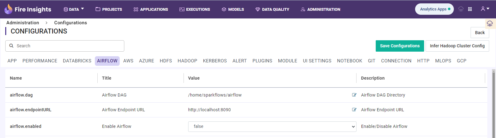

Configuring Pipelines
======================

Sparkflows uses Apache Airflow for executing Pipelines.

Below are the configurations needed for Sparkflows and Airflow to integrate seamlessly:

   

- Set **airflow.enabled** to **true**.
- Set **airflow.home** value to home directory of airflow. Eg: **/home/sparkflows/airflow**
- Set **airflow.endpointURL** value to the airflow webserver URL. Eg: **http://localhost:8090**
