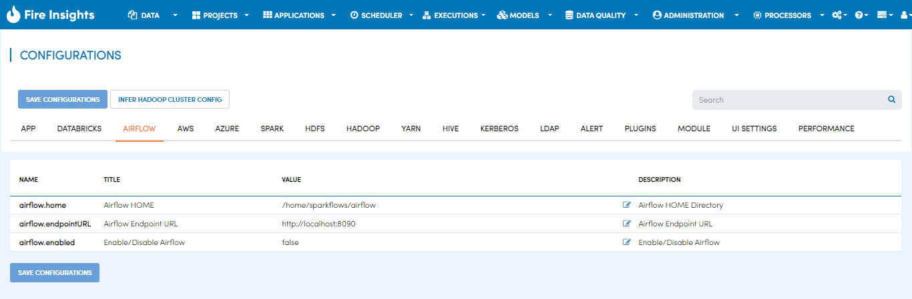

Configuring Pipelines
======================

Fire uses Apache Airflow for executing Pipelines. Hence Airflow has to be installed on the same machine as Fire.

Below are the configurations needed in Fire for Airflow.

   
