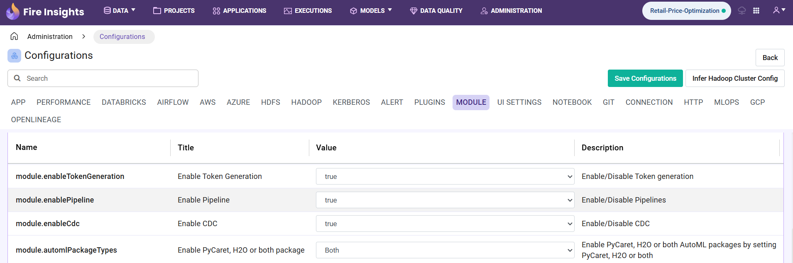

Configuring Pipelines
======================

Sparkflows uses Apache Airflow for executing Pipelines.

Steps Involved in Configuring Pipeline in Sparkflows:

1. **Login to Sparkflows Web Server URL and traverse to Administrations -> Configurations and enable the below properties:**

::

    module.enablePipeline	true

.. figure:: ../../../_assets/aws/livy/administration.png
   :alt: livy
   :width: 60%

   
2. **Once the above Configuration is enabled, you will see three tabs in project namely** ``Pipelines, Executions & Schedules`` 

.. figure:: ../../../_assets/user-guide/pipeline/pipeline-list-new.png
   :alt: Pipeline List
   :width: 60% 
