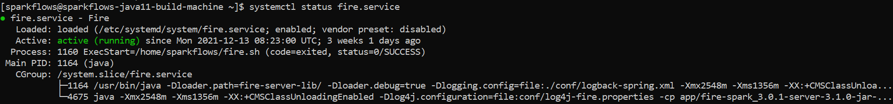

Running Fire as a Service
=========================

Fire Insights can be configured to run as a service. This way when the machine reboots, Fire Insights would be automatically restarted.

Below are the steps for configuring Fire Insights as a service.

Prerequisites
+++++++++++++

::
   
   Make sure that user have root privilege to create a service.
   System Distribution have SystemD as init system (Amazon Linux 2, SLES 12, CentOS 7 or higher, Debian 8 or higher, RHEL 7 or higher, Ubuntu 15.04 or higher)

Create a fire service
--------------------

Create a fire service which run as systemd service as specific user(for Fire Insights to start up at reboot), inside `/etc/systemd/system` location, which trigger a shell script to start Fire Insights server.

::

    [Unit]
    Description=Fire
    After=network.target

    [Service]
    Type=forking
    User=sparkflows
    ExecStart=/home/sparkflows/fire.sh
    RestartSec=35
    Restart=on-abort

   [Install]
   WantedBy=multi-user.target

Add a shell script
----------------

Add a shell script `fire.sh` in location updated in fire service for Starting Fire server.

Add Below to it and provide appropriate permission

::

    #!/bin/sh
    cd $fire_home/fire-3.1.0_spark_x.y.z
    ./run-fire-server.sh start

Once the above steps is updated, you can run do and verify the below steps:

- Refresh the systemd configuration files

::

   systemctl daemon-reload
   
- enable the service (if required) to start automatically at boot

::

    systemctl enable fire.service
    
- Verify the systemd unit file configuration

::

    systemctl restart fire.service
    systemctl status fire.service
    

    

.. note:: Make sure that services are enabled
    
