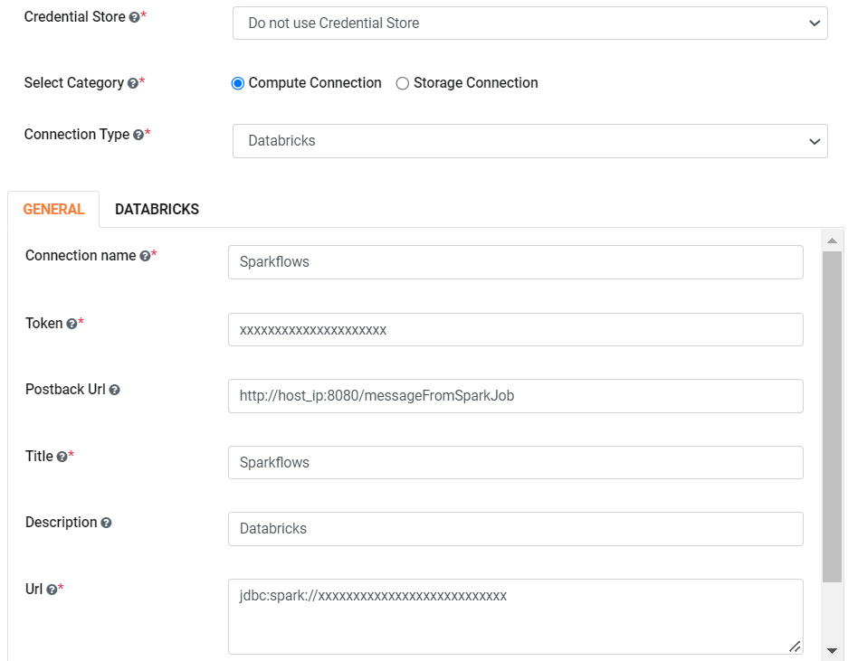
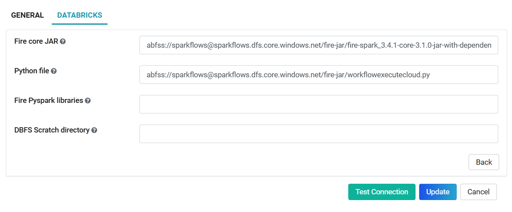

Databricks Connection
=======

Sparkflows enables you to create Databricks connection and use the connection to submit job on respective Databricks cluster. Connections can be at various levels:

  * Global : Everyone has access to these connections.
  * Group  : Users belonging to the group have access to these connections.
  * Project: The owner of the project and the groups with which the Project has been shared with have access to the Project level connections.

Below are the steps required to create Databricks connection:

1. Login to Sparkflows web server URL. 

It can be created by the administrator under ''Administration/Global Connections''. These connections are available for everyone to use. For more details refer the following table:

GENERAL Tab :

.. list-table:: 
   :widths: 10 20 20
   :header-rows: 1

   * - Title
     - Description
     - Value
   * - CREDENTIAL STORE  
     - Select the Credential Store from drop-down
     - Choose specific Credential Store from drop-down or Select Do not use Credential Store
   * - Select Category
     - Select Category of Connection Type
     - Select Compute Connection
   * - CONNECTION TYPE 
     - Select the Connection type from drop-down
     - Choose Databricks as Connection Type
   * - CONNECTION NAME
     - Connection Name
     - Add an unique Connection Name
   * - TOKEN 
     - Token
     - Add token generated
   * - POSTBACK URL
     - Fire Insights Post Back URL
     - Add Fire Insights Post Back URL
   * - TITLE 
     - Title for selected Connection
     - Add an unique Title
   * - DESCRIPTION
     - Connection Description
     - Add some Connection Description
   * - URL
     - Jdbc url for databricks connection
     - Add Jdbc Url for Databricks Connection
     

For more details on creating Databricks connection refer the following image:

DATABRICKS Tab :

.. list-table:: 
   :widths: 10 20 20
   :header-rows: 1

   * - Title
     - Description
     - Value
   * - Fire core jar
     - path of Fire core jar dependencies
     - Absolute path of Fire core jar  
   * - Python file
     - path of Pyspark main file
     - Absolute path of Pyspark main file
   * - Fire pyspark libraries
     - path of Fire pyspark libraries
     - Absolute path of Fire pyspark libraries
   * - DBFS Scratch directory
     - Scratch directory on DBFS where it have Read/Write/Delete Permissions.
     - Absolute path ex. dbfs:/FileStore

2.  Test & Save the Connection

Once you save the connection, it can be used for submitting the job on specific Databricks cluster.

Documentation
+++++

Reference guide : `Databricks User Guide Documentation. <https://docs.sparkflows.io/en/latest/databricks-user-guide/index.html>`_

.. note:: Make sure to add "POSTBACK URL" through which jobs running on Databricks would post back results to Sparkflows using this URL or else it will take from ``app.postMessageURL``, added in configuration.
