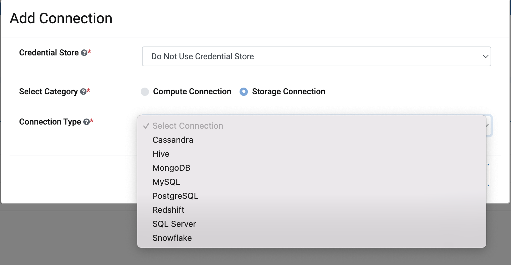
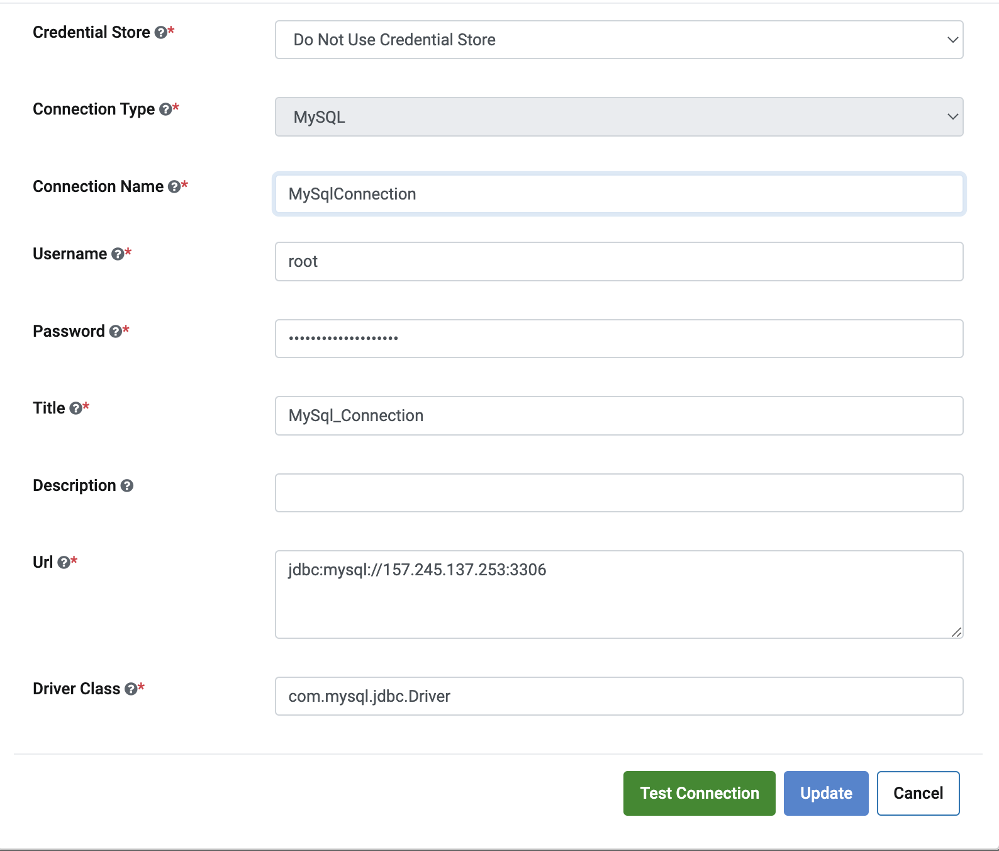

MySQL Connection
================

Fire Insights provides the capability to create MySQL connection and use the connection for reading from and writing to MySQL tables. Below are the steps for creating MySQL connection in Fire Insights:

  * Download MySQL JDBC Driver
  * Install the JDBC Driver
  * Restart Fire Insights
  * Create the MySQL Connection

Download MySQL JDBC Driver
-------------

- MySQL JDBC Driver can be downloaded from : https://dev.mysql.com/downloads/connector/j/ or you can download it directly from maven repository : https://repo1.maven.org/maven2/mysql/mysql-connector-java/8.0.11/
- After downloading, untar it with : ``tar xvf mysql-connector-java-8.0.11.tar.gz`` 
- After untaring, the JDBC JAR file is available in the directory.
- Use the JAR file (mysql-connector-java-8.0.11.jar) for installation in the Fire.

Install the JDBC Driver
--------

In order to install the JDBC driver copy the driver jdbc jar file into ``fire-user-lib`` and ``fire-server-lib`` directories under the Fire installation home directory.

Restart Fire Server
------------

Once you have copied the JDBC driver into the required folder, restart the Fire server with ``./run-fire-server.sh restart`` for it to register the new driver.

This will restart the Fire services automatically.

Or else, you can also wait for 60 minutes and the JDBC driver would be automatically registered with Fire Insights.

Create the MySQL Connection
-----

Create the MySQL Connection at Global, Group or Project level.

Connection Details
++++

Enter the configuration details with the help of table given below and click on ``Add Connection``.

                                                 
Test Connection and Save
+++++

Once you have entered the connection details, click on ``Test Connection``. If the connection is successful,  click on ``Save`` to save the connection. 

Now, you are ready to start using the Connection in workflows.

.. Note:: Make sure that MySQL URL should be accessible from Sparkflows web server URL.

Connection Field Details
----------------------

.. list-table:: 
   :widths: 10 20 20
   :header-rows: 1

   * - Title
     - Description
     - Value
   * - Credential Store  
     - Select the Credential Store from drop-down
     - Choose specific Credential Store from drop-down or Select Do not use Credential Store
   * - Select Category
     - Select Category of Connection Type
     - Select Storage Connection
   * - Connection Type 
     - Select the Connection type from drop-down
     - Choose MySQL as Connection Type
   * - Connection Name
     - Connection Name
     - Add an unique Connection Name
   * - Username 
     - Username
     - Username for MySQL
   * - Password
     - Password
     - Password of MySQL
   * - Title 
     - Title for selected Connection
     - Add an unique Title
   * - Description
     - Connection Description
     - Add some Connection Description
   * - Url
     - Url for MySQL
     - JDBC Url for MySQL
   * - Driver Class
     - Driver Class Name for MySQL
     - com.mysql.jdbc.Driver (by default)
      
Run Workflows using MySQL JDBC JAR
-----------------

When running workflows, select the checkbox for the JAR file ( mysql-connector-java-X.Y.Z.jar) in the Workflow Execution Page.

