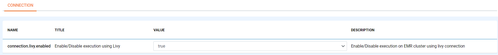

MySQL Connection
====

Sparkflows enabled you to create MySQL Connection and use the connection to access various resources.

Connections can be at various levels:

  * Global : Everyone has access to these connections
  * Group : Users belonging to the group have access to these connections
  * Project : The owner of the project and the groups with which the Project has been shared with have access to the Project level connections

Below are steps on how to create MySQL Connection:

1. Login to Sparkflows WEB Server Url

It can be created by the Administrator under ''Administration/Global Connections''. These connections are available for everyone to use.

.. list-table:: 
   :widths: 10 20 20
   :header-rows: 1

   * - Title
     - Description
     - Value
   * - CREDENTIAL STORE  
     - Select the Credential Store from drop-down
     - Choose specific Credential Store from drop-down or Select Do not use Credential Store
   * - Select Category
     - Select Category of Connection Type
     - Select Storage Connection
   * - CONNECTION TYPE 
     - Select the Connection type from drop-down
     - Choose MySQL as Connection Type
   * - CONNECTION NAME
     - Connection Name
     - Add an unique Connection Name
   * - Username 
     - Username
     - Username for MySQL
   * - Password
     - Password
     - Password of MySQL
   * - TITLE 
     - Title for selected Connection
     - Add an unique Title
   * - DESCRIPTION
     - Connection Description
     - Add some Connection Description
   * - URL
     - Url for MySQL
     - JDBC Url for MySQL
   * - Driver Class
     - Driver Class Name for MySQL
     - com.mysql.jdbc.Driver (by default)
     
.. figure:: ../../../_assets/installation/connection/mysql_storage.PNG
   :alt: connection
   :width: 60%
   
.. figure:: ../../../_assets/installation/connection/mysql_connections.PNG
   :alt: connection
   :width: 60%   

2. Test Connection and Save

Once you have updated the above parameters, click on ``Test Connection``, if the Connection is Successful, ``Save`` the connection.

Now you can created connection use the resources in datasets and workflows.

.. Note:: Make sure that MySQL URL should be accessible from Sparkflows webserver URL.
