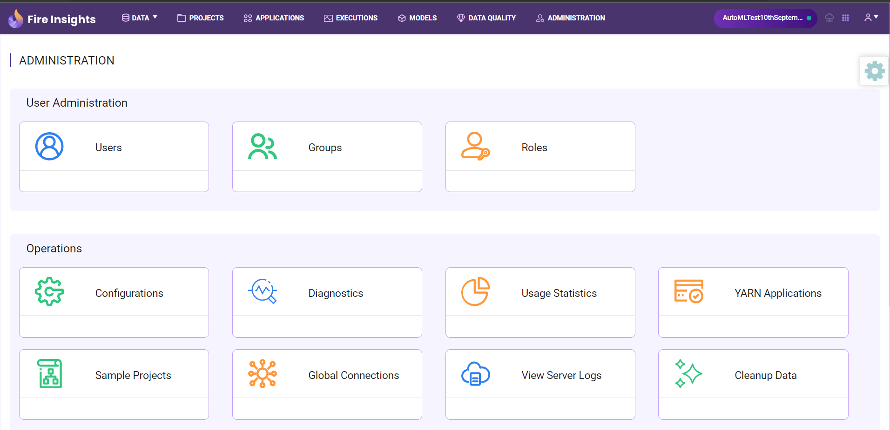

MySQL Connection
================

Sparkflows provides the capability to create MySQL connection and use the connection to access various resources. This document explains steps required to create MySQL Connection.

Prerequisites
--------

**Install JDBC Driver:**

The JDBC Driver needs to be installed in Fire in order to connect to MySQL JDBC Source. 

More information on installation can be found at: https://docs.sparkflows.io/en/latest/operations/installing-jdbc-drivers.html

**Type of Connection:**

Connections can be created at various levels:

* Global  : Everyone has access to these connections.
* Group   : Users belonging to a group will only have access to these connections.
* Project : The owner of the project and the groups with which the project has been shared with have access to these connections.

Below are steps on how to create MySQL Connection.

Login to Sparkflows
----------

Login to Sparkflows as an ``Admin``. Click on ``Administration`` tab from the main menu and then select ``Global Connections`` to reach the next page as shown below.

Add Connection
----------

Enter the configuration details with the help of table given below and click on ``Add Connection``.

.. figure:: ../../../_assets/installation/connection/mysql_storage.PNG
   :alt: connection
   :width: 60%

Enter Configuration Details
-------------

Adding connection would take you to another configuration page as shown below. Refer the table given below to enter the details on this page.

.. figure:: ../../../_assets/installation/connection/mysql_connections.PNG
   :alt: connection
   :width: 60%  
                                                 
Test Connection and Save
--------------------

Once you have entered all the details, click on ``Test Connection``. If the connection is successful,  click on ``Save`` to save the connection. 

Now, you are ready to create connection using the resources in datasets and workflows.

.. Note:: Make sure that MySQL URL should be accessible from Sparkflows web server URL.

Run Workflows using MySQL JDBC JAR
-----------------

When running workflows, select the checkbox for the JAR file ( mysql-connector-java-X.Y.Z.jar) in the Workflow Execution Page.

Configuration Details
----------------------

.. list-table:: 
   :widths: 10 20 20
   :header-rows: 1

   * - Title
     - Description
     - Value
   * - Credential Store  
     - Select the Credential Store from drop-down
     - Choose specific Credential Store from drop-down or Select Do not use Credential Store
   * - Select Category
     - Select Category of Connection Type
     - Select Storage Connection
   * - Connection Type 
     - Select the Connection type from drop-down
     - Choose MySQL as Connection Type
   * - Connection Name
     - Connection Name
     - Add an unique Connection Name
   * - Username 
     - Username
     - Username for MySQL
   * - Password
     - Password
     - Password of MySQL
   * - Title 
     - Title for selected Connection
     - Add an unique Title
   * - Description
     - Connection Description
     - Add some Connection Description
   * - Url
     - Url for MySQL
     - JDBC Url for MySQL
   * - Driver Class
     - Driver Class Name for MySQL
     - com.mysql.jdbc.Driver (by default)
      

