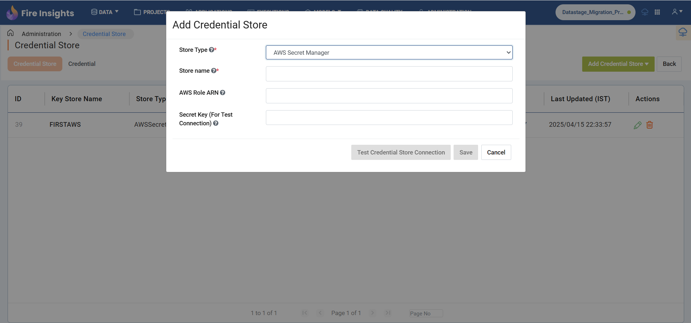
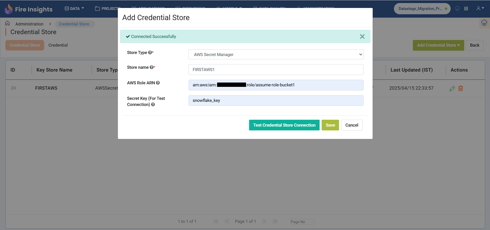
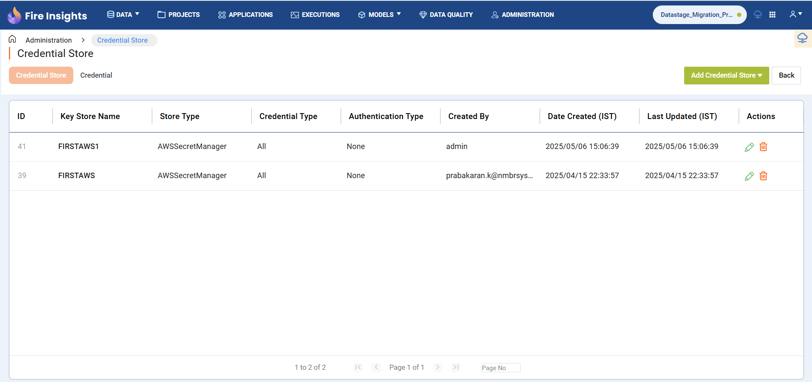
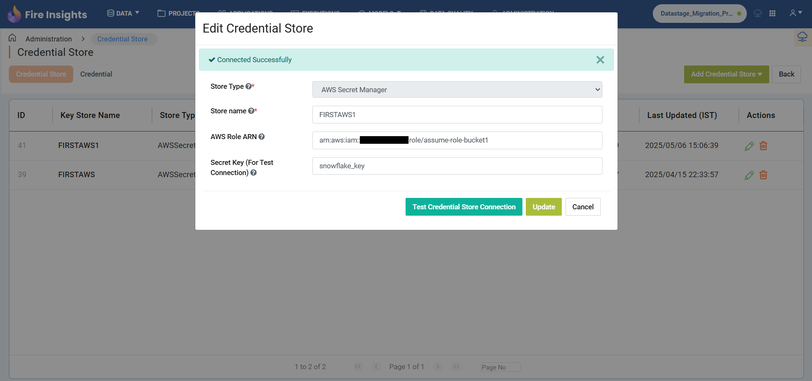

AWS Credential Store
=======================

You can configure AWS credential store in sparkflows. Below are the steps for configuring AWS credential store:

Go to Administration -> Credential Store
-------------

Login to Fire Insights application as an admin user. Go to ``Administration`` and select ``Credential Store``.

.. figure:: ../../../_assets/credential_store/credential_store_5.PNG
   :alt: AWS Credential Store
   :width: 65%

Add Credential Store
------------------

Click on the ``ADD CREDENTIAL STORE`` button.

.. figure:: ../../../_assets/credential_store/credential_store_6.PNG
   :alt: Credential Store
   :width: 65%

Add Credential Store Parameters
--------------------------

.. list-table:: Credential Store
   :widths: 20 80
   :header-rows: 1

   * - Title
     - Description
   * - STORE TYPE
     - Select AWS Secret Manager
   * - STORE NAME
     - Add any unique name.
   * - AWS ROLE ARN
     - Assume role ARN to access resources
   * - SECRET KEY
     - Secret Key (For Test Connection)
     

After adding the above parameters, you can click on ``TEST CREDENTIAL STORE CONNECTION`` to verify the connection before saving it.

    

Credential Store Created
------------------------

Once the credential store has been created, you can view it in the list of credential stores.

Update Credential Store
------------------------

Once the credential store for AWS Secrets Manager has been created, the user can modify it by clicking the edit icon in the Action column of the list table.

